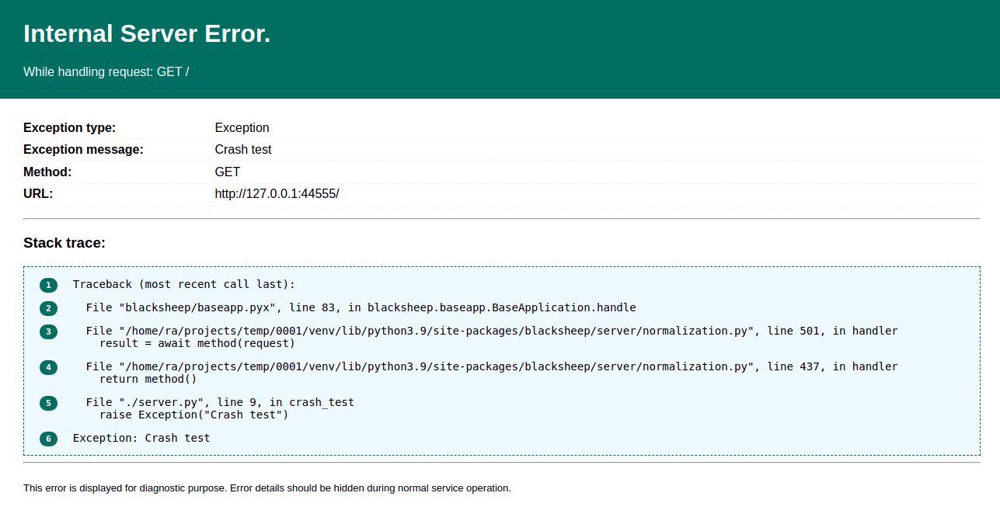
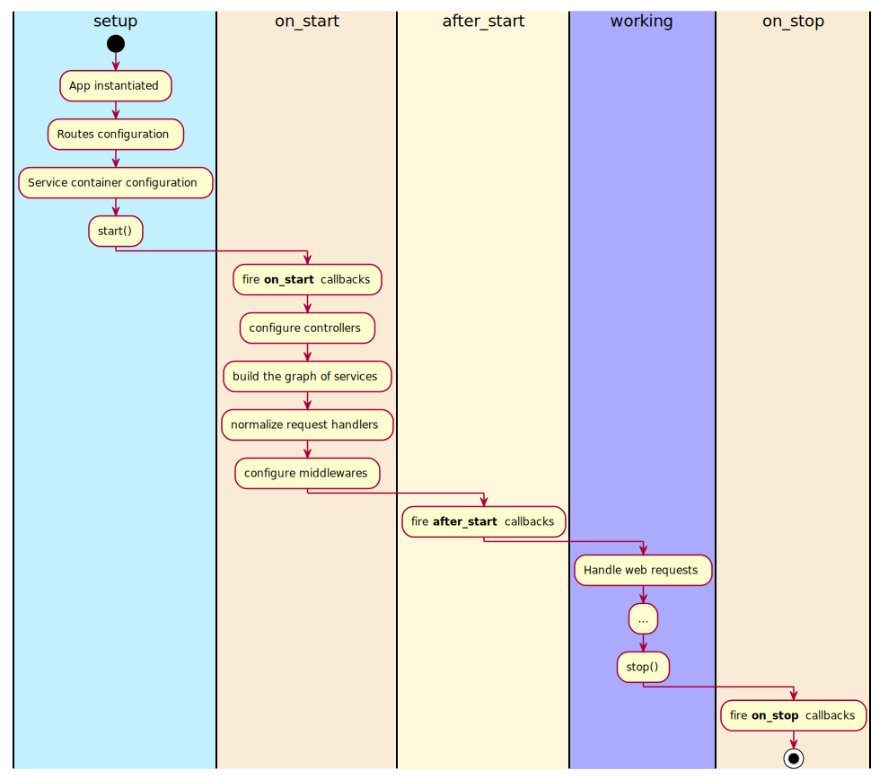

# The Application class
The `Application` class in BlackSheep is responsible of handling the
application life cicle (start, working state, stop), routing, web requests,
exceptions. This page describes details of the `Application` class:

- [X] How to handle errors.
- [X] Application events and life cycle.

## Handling errors

BlackSheep catches any unhandled exception that happens during the execution of
request handlers, producing a `HTTP 500 Internal Server Error` response. To see
this in practice, start an application like the following:

```python
from blacksheep import Application, get

app = Application()


@get("/")
def crash_test():
    raise Exception("Crash test")
```

And observe how a request to its root produces a response with HTTP status 500,
and the text "Internal server error".

Exception details are hidden to the client by default: it would be a security
issue if the web application returned error details to the client. However,
while developing and occasionally while investigating issues, it is useful to
be able to obtain error details directly from the web requests that are
failing. To enable error details, update the app declaration as follows:

```python
app = Application(show_error_details=True)
```

Now the application returns the details of the exception with the full stack
trace, serving a page like the following:



Consider using environmental variables to handle this kind of settings that
can vary across environments. For example:

```python
import os
from blacksheep import Application

app = Application(show_error_details=bool(os.environ.get("SHOW_ERROR_DETAILS", None)))


@get("/")
def crash_test():
    raise Exception("Crash test")

```

!!! info "Settings strategy"
    BlackSheep project templates include a strategy to handle application
    settings and configuration roots.

### Configuring exceptions handlers

The BlackSheep `Application` object has a `exceptions_handlers` dictionary that
defines how errors should be handled. When an exception happens while handling
a web request and reaches the application, the application checks if there is a
matching handler for that kind of exception. An exception handler is defined as
a function with the following signature:

```python
from blacksheep import Request, Response, text

async def exception_handler(self, request: Request, exc: Exception) -> Response:
    pass
```

In the exception below
```python

class CustomException(Exception):
    pass

async def exception_handler(self, request, exc: CustomException):
    nonlocal app
    assert self is app
    assert isinstance(exc, CustomException)
    return text("Called")


# Register the exception handler for the CustomException type:
app.exceptions_handlers[CustomException] = exception_handler


@get('/')
async def home(request):
    # of course, the exception can be risen at any point
    # for example in the business logic layer
    raise CustomException()

```

Exceptions inheriting from `HTTPException` can be mapped to handlers by their
type or by their status code, using `int` keys; while user defined exceptions
are mapped to handlers by their type.

When an exception handler is registered for a type of exception, all subclasses
are also handled by that handler. It is however possible to define a more
specific handler for one of the descendant classes.

### Configuring exception handlers using decorators

It is also possible to register exception handlers using decorators, instead
of interacting with `app.exceptions_handlers` dictionary:

```python
class CustomException(Exception):
    pass


@app.exception_handler(CustomException)
async def handler_example(self, request, exc: CustomException):
    ...

```

### Overriding the default exception handler for unhandled exceptions

To override how unhandled exceptions are handled, define a custom `Application`
class overriding its `handle_internal_server_error` method, like in the
following example:

```python

from blacksheep import Application, json
from blacksheep.messages import Request


class MyApp(Application):
    async def handle_internal_server_error(self, request: Request, exc: Exception):
        # TODO: handle this like you wish!
        return json({"message": "Oh, no!"}, 500)
```

---

## Application events

A BlackSheep application exposes three events: **on_start**, **after_start**,
**on_stop**. These events can be used to configure callbacks and services that
depend on application lifecycle. The application class also offers a useful
method to configure objects that need to be initialized when the application
starts, and disposed when the application stops: **lifespan**.

### Using the lifespan decorator

The `Application.lifespan` method can be used to register objects bound to the
application life cycle. Common examples of such objects are HTTP clients and
database clients, since they use connection pools that can be initialized
and must be disposed when the application stops.

The following example illustrates how to use the `@app.lifespan` decorator to
create an HTTP `ClientSession` that will be disposed when the application
stops. Note how the instance of `ClientSession` is also bound to application
services, so that it can be injected into request handlers that need it.

```python
import asyncio
from blacksheep import Application
from blacksheep.client.pool import ClientConnectionPools
from blacksheep.client.session import ClientSession

app = Application()


@app.lifespan
async def register_http_client():
    async with ClientSession(
        pools=ClientConnectionPools(asyncio.get_running_loop())
    ) as client:
        print("HTTP client created and registered as singleton")
        app.services.register(ClientSession, instance=client)
        yield

    print("HTTP client disposed")


@router.get("/")
async def home(http_client: ClientSession):
    print(http_client)
    return {"ok": True, "client_instance_id": id(http_client)}


if __name__ == "__main__":
    import uvicorn

    uvicorn.run(app, host="127.0.0.1", port=44777, log_level="debug", lifespan="on")
```

!!! info
    The method leverages `contextlib.asynccontextmanager`. What is defined
    before the `yield` statement executes when the application starts, and what
    is defined after the `yield` statement executes when the application stops.

The following example illustrates how a `redis-py` [connection can be disposed](https://redis.readthedocs.io/en/stable/examples/asyncio_examples.html)
using the same method:

```python
import redis.asyncio as redis

...

@app.lifespan
async def configure_redis():
    """
    Configure an async Redis client, and dispose its connections when the
    application stops.
    See:
    https://redis.readthedocs.io/en/stable/examples/asyncio_examples.html
    """
    connection = redis.Redis()
    print(f"Ping successful: {await connection.ping()}")

    app.services.register(redis.Redis, instance=connection)

    yield connection

    print("Disposing the Redis connection pool...")
    await connection.close()
```

!!! info "Example using Redis"
    The `BlackSheep-Examples` repository includes an example where `Redis` is
    used to store access tokens and refresh tokens obtained using
    `OpenID Connect`: [example](https://github.com/Neoteroi/BlackSheep-Examples/blob/main/oidc/scopes_redis_aad.py). For more information on `redis-py` and its async
    interface, refer to its [official documentation](https://redis.readthedocs.io/en/stable/examples/asyncio_examples.html).

### on_start

This event should be used to configure things such as new request handlers,
and service registered in `app.services`, such as database connection pools,
HTTP client sessions.

### after_start

This event should be used to configure things that must happen after request
handlers are normalized. At this point, the application router contains information
about actual routes handled by the web application, and routes can be inspected.
For example, the built-in generation of OpenAPI Documentation generates the
API specification file at this point.

### on_stop

This event should be used to fire callbacks that need to happen when the application
is stopped. For example, disposing of services that require disposal, such as
database connection pools, HTTP client sessions using connection pools.

### Application life cycle

Refer to the following diagram to know more about when application events
are fired, and the state of the application when they are executed.



### How to register event handlers

=== "Using decorators"
    Event handlers can be registered using decorators.

    ```python
    from blacksheep import Application, Request, Response, text, get


    app = Application()


    @get("/")
    async def home(request: Request) -> Response:
        return text("Example Async")


    @app.on_start
    async def before_start(application: Application) -> None:
        print("Before start")


    @app.after_start
    async def after_start(application: Application) -> None:
        print("After start")


    @app.on_stop
    async def on_stop(application: Application) -> None:
        print("On stop")

    ```

=== "Using +="
    In alternative to decorators, event handlers can be registered using ` += `:

    ```python
    from blacksheep import Application, Request, Response, text, get


    app = Application()


    @get("/")
    async def home(request: Request) -> Response:
        return text("Example Async")


    async def before_start(application: Application) -> None:
        print("Before start")


    async def after_start(application: Application) -> None:
        print("After start")


    async def on_stop(application: Application) -> None:
        print("On stop")


    app.on_start += before_start
    app.after_start += after_start
    app.on_stop += on_stop
    ```

!!! info
    For example, to define an `after_start` callback that logs all routes registered
    in the application router:

    ```python
    @app.after_start
    async def after_start_print_routes(application: Application) -> None:
        print(application.router.routes)
    ```

## Next

Read about the details of [routing in BlackSheep](../routing).
