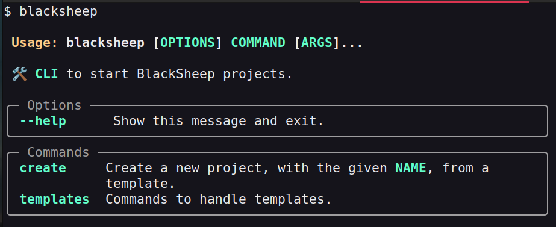
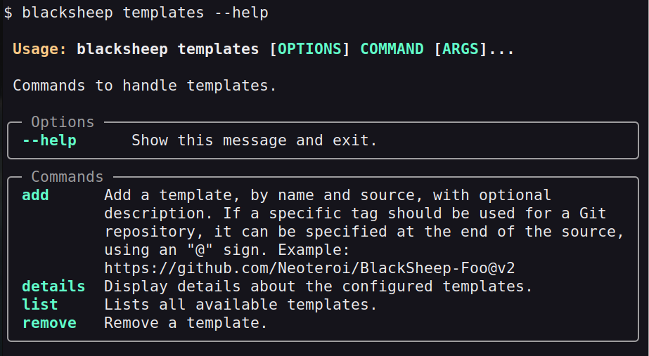
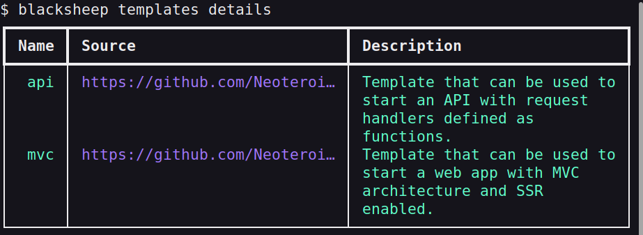
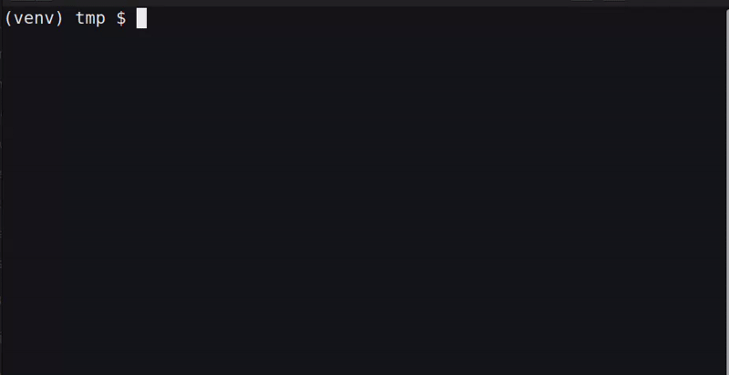

# More about the BlackSheep-CLI

The second version of the web framework offers a command-line interface (CLI)
to bootstrap new projects using templates, inspired by similar CLIs of popular
front-end web frameworks.

This page describes the CLI in details, covering the following subjects:

- [X] How to install the `blacksheep-cli`.
- [X] How to use its help.
- [X] How to create a new project.
- [X] How to configure new templates.

## Installing the CLI

The CLI is distributed as a separate package, and can be installed from the
Python Package Index:

```bash
pip install blacksheep-cli
```

Once installed, the CLI can be used to bootstrap new projects using interactive
prompts.


!!! tip "Beware of dependencies"
    It is recommended to use the `blacksheep-cli` only to bootstrap new projects,
    and to not include it as a dependency for web projects, because it
    includes several dependencies that are not necessary to run a web server.

## Using the help

The `blacksheep-cli` is a [Click application](https://click.palletsprojects.com/en/8.1.x/)
with auto-generated help. Type `blacksheep` or `blacksheep --help` to display the help,
with the list of command groups:



To display the help of a specific commands group, use the command group name
followed by `--help`, like in the following example:



## Listing available templates

The `blacksheep-cli` is pre-configured with official templates. To list the
available templates, use the `blacksheep templates list`, or the
`blacksheep templates details` commands.

```bash
$ blacksheep templates list
api
mvc
```

To display details about the templates, which are stored in a configuration file
in the user's folder, use the `blacksheep templates details` command:



!!! info "Available templates"
    At the time of this writing, there are two officially maintained templates.
    More can be added in the future, and users can configure additional
    templates using the `blacksheep templates add` command.

## Creating a new project

Use the `blacksheep create` command to bootstrap a project
using one of the supported templates. The command will prompt for the necessary
input to bootstrap a new project. Aside from project name and template type,
each project template defines the parameters that are needed.



The CLI includes a help, and supports custom templates, using the
same sources supported by `Cookiecutter`.

## Templates commands

| Command   | Description                                                                                                                                                                                        |
| --------- | -------------------------------------------------------------------------------------------------------------------------------------------------------------------------------------------------- |
| `add`     | Adds a new template to the list of available templates. This information is stored in a configuration file in the user's folder (this is an implementation detail and might change in the future). |
| `remove`  | Removes a template from the list of available templates.                                                                                                                                           |
| `list`    | Lists the names of the available templates.                                                                                                                                                        |
| `details` | Displays details about the available templates.                                                                                                                                                    |

## Creating a new template

To create a new project template, define a new `cookiecutter` template.

- [cookiecutter docs](https://cookiecutter.readthedocs.io/en/stable/)
- [API template, which can be followed as example](https://github.com/Neoteroi/BlackSheep-API)

To offer a better prompt, include a `questions.json` file for Python `questionary`,
whose questions match the parameters described in `cookiecutter.json`; like in
[the API template](https://github.com/Neoteroi/BlackSheep-API/blob/main/questions.json).

All [sources supported by
`cookiecutter`](https://cookiecutter.readthedocs.io/en/stable/usage.html#grab-a-cookiecutter-template)
will also be supported by the `blacksheep-cli`.

Then include it in the list of available templates, using the `templates add` command,
like in:

```bash
blacksheep templates add foo https://github.com/Neoteroi/BlackSheep-Foo -d 'Some nice template! 🐃'
```

To use a specific `git` tag, add a `@{tag}` suffix to the source, like:

```bash
blacksheep templates add foov2 https://github.com/Neoteroi/BlackSheepFoo@v2
```

## Cookiecutter

The `blacksheep-cli` uses [`Cookiecutter`](https://cookiecutter.readthedocs.io/en/stable/)
under the hood, with [`questionary`](https://pypi.org/project/questionary/) to
offer better prompts.

The official templates are `cookiecutter` templates, that can be used in non-interactive
way if desired, using the `cookiecutter` CLI. This can be useful to bootstrap new
projects in automated jobs (CI/CD).

For example, to bootstrap a new project using the API template, with name "foo"
and using TOML files for application settings:

```bash
cookiecutter https://github.com/Neoteroi/BlackSheep-API --no-input project_name=foo app_settings_format=TOML
```
