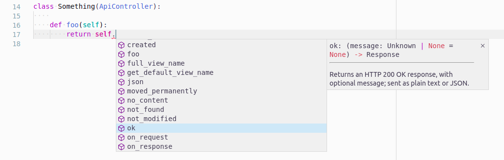

# Controllers
BlackSheep has built-in features to support MVC (Model, View, Controller)
architecture. A `Controller` is a class having at least one method registered
as request handler (i.e. associated to a route). A Controller is instantiated
at each web request, when a web request is matched by a route defined in that
type of controller.

This page describes:

- [X] Controller methods.
- [X] API Controllers.

It is recommended to follow the [MVC tutorial](../mvc-project-template/) before
reading this page.

!!! tip "For Flask users..."
    If you come from Flask, controllers in BlackSheep would be the equivalent of
    Flask's Blueprints, as they allow to group request handlers in dedicated
    modules and classes.

## The Controller class
Controllers implement several methods to simplify returning responses. These
are the same described at [Responses](../responses/), but they can be overridden
in subclasses of `Controller` and they remove the need to import functions.

| Method                 | Description                                                                                                                                                                                                |
| ---------------------- | ---------------------------------------------------------------------------------------------------------------------------------------------------------------------------------------------------------- |
| **ok**                 | Returns an HTTP 200 OK response, with optional message; sent as plain text or JSON.                                                                                                                        |
| **status_code**        | Returns a plain response with given status, with optional message; sent as plain text or JSON.                                                                                                             |
| **created**            | Returns an HTTP 201 Created response, to the given location and with optional JSON content.                                                                                                                |
| **accepted**           | Returns an HTTP 202 Accepted response, with optional message; sent as plain text or JSON.                                                                                                                  |
| **no_content**         | Returns an HTTP 204 No Content response.                                                                                                                                                                   |
| **json**               | Returns a response with application/json content, and given status (default HTTP 200 OK).                                                                                                                  |
| **pretty_json**        | Returns a response with indented application/json content, and given status (default HTTP 200 OK).                                                                                                         |
| **text**               | Returns a response with text/plain content, and given status (default HTTP 200 OK).                                                                                                                        |
| **html**               | Returns a response with text/html content, and given status (default HTTP 200 OK).                                                                                                                         |
| **moved_permanently**  | Returns an HTTP 301 Moved Permanently response, to the given location.                                                                                                                                     |
| **redirect**           | Returns an HTTP 302 Found response (commonly called redirect), to the given location.                                                                                                                      |
| **see_other**          | Returns an HTTP 303 See Other response, to the given location.                                                                                                                                             |
| **not_modified**       | Returns an HTTP 304 Not Modified response.                                                                                                                                                                 |
| **temporary_redirect** | Returns an HTTP 307 Temporary Redirect response, to the given location.                                                                                                                                    |
| **permanent_redirect** | Returns an HTTP 308 Permanent Redirect response, to the given location.                                                                                                                                    |
| **bad_request**        | Returns an HTTP 400 Bad Request response, with optional message; sent as plain text or JSON.                                                                                                               |
| **unauthorized**       | Returns an HTTP 401 Unauthorized response, with optional message; sent as plain text or JSON.                                                                                                              |
| **forbidden**          | Returns an HTTP 403 Forbidden response, with optional message; sent as plain text or JSON.                                                                                                                 |
| **not_found**          | Returns an HTTP 404 Not Found response, with optional message; sent as plain text or JSON.                                                                                                                 |
| **view**               | Returns a view rendered synchronously.                                                                                                                                                                     |
| **view_async**         | Returns a view rendered asynchronously.                                                                                                                                                                    |
| **file**               | Returns a binary file response with given content type and optional file name, for download (attachment) (default HTTP 200 OK). This method supports both call with bytes, or a generator yielding chunks. |

For information on how to use these methods, refer to the type annotations
provided in the code.



!!! info
    Using an IDE like JetBrains PyCharm, or Visual Studio Code (as in
    the screenshot above), enables automatic completion and hints thanks to type
    annotations.

### on_request and on_response

Using controllers it is possible to define methods that are always executed
before handling a request and after producing a response:

```python
class Example(Controller):

    async def on_request(self, request: Request):
        print("Received a request!")

    async def on_response(self, response: Response):
        print("Produced response!")
```

Using controllers involves a performance fee compared to using functions because
a controller must be instantiated at each web request, but has the following
benefits:

* Controllers support [dependency injection](../dependency-injection/) to
  receive services for their constructors, in addition to [dependency
  injection](../dependency-injection) for every single request handler
* Controllers support defining an `on_request(request: Request)` method, that
  gets called at every web request, `on_response(response: Response)` method,
  and base `route` (defined as class method) for all handlers defined in the
  class.
* Controllers provide methods to produce responses, that can be overridden in
  base classes to personalize the behavior of the application without
  monkey-patching functions

Therefore they can help avoiding code repetition in some circumstances.

The following example shows how dependency injection can be used for
controllers' constructors, and an implementation of `on_request` method:

```python

app = Application()


class Settings:

    def __init__(self, greetings: str):
        self.greetings = greetings


class Home(Controller):

    def __init__(self, settings: Settings):
        # controllers are instantiated dynamically at every web request
        self.settings = settings

    async def on_request(self, request: Request):
        print("[*] Received a request!!")

    def greet(self):
        return self.settings.greetings

    @get("/")
    async def index(self, request: Request):
        return text(self.greet())

# when configuring the application, register
# a singleton of the application settings,
# this service is automatically injected into request handlers
# having a signature parameter type annotated `: Settings`, or
# having name "settings", without type annotations
app.services.add_instance(Settings(value))
```

If route methods (e.g. `head`, `get`, `post`, `put`, `patch`) from
`blacksheep.server.controllers` are used, then the default singleton `Router`
instance for controllers is used. It is also possible to use a specific router,
as long as this router is bound to the application object:

```py
from blacksheep.server.routing import RoutesRegistry


app = Application()
app.controllers_router = RoutesRegistry()
get = app.controllers_router.get
```

## The ApiController class
The `ApiController` class is a kind of `Controller` dedicated to API
definitions. An ApiController offers some properties to enable versioning
of routes and adding a common path prefix to all routes, for example prepending
"/v1/" fragment to all routes and the name of the controller class.

```python
from blacksheep import Response, FromJSON, FromQuery
from blacksheep.server.controllers import ApiController, delete, get, patch, post


class Cats(ApiController):
    @get()
    def get_cats(
        self,
        page: FromQuery[int] = FromQuery(1),
        page_size: FromQuery[int] = FromQuery(30),
        search: FromQuery[str] = FromQuery(""),
    ) -> Response:
        """Returns a list of paginated cats."""

    @get("{cat_id}")
    def get_cat(self, cat_id: UUID) -> Response:
        """Gets a cat by id."""

    @patch("{cat_id}")
    def update_cat(self, cat_id: str, input: UpdateCatInput) -> Response:
        """Updates a cat with given id."""

    @post()
    def create_cat(self, input: FromJSON[CreateCatInput]) -> Response:
        """Creates a new cat."""

    @delete("{cat_id}")
    def delete_cat(self, cat_id: str) -> Response:
        """Deletes a cat by id."""
```

In the example above, the routes defined on the `Cats` class will result in
the following paths:

| HTTP Method | Path               | Request handler | Description                       |
| ----------- | ------------------ | --------------- | --------------------------------- |
| HTTP GET    | /api/cats          | `get_cats`      | Returns a list of paginated cats. |
| HTTP GET    | /api/cats/{cat_id} | `get_cat`       | Gets a cat by id.                 |
| HTTP POST   | /api/cats/{cat_id} | `create_cat`    | Creates a new cat.                |
| HTTP PATCH  | /api/cats/{cat_id} | `update_cat`    | Updates a cat with given id.      |
| HTTP DELETE | /api/cats/{cat_id} | `delete_cat`    | Deletes a cat by id.              |

To include a version number in the API, implement a `version` `@classmethod` like in the
following example:

```python
class Cats(ApiController):

    @classmethod
    def version(cls) -> str:
        return "v1"

    ...
```

In such case, the generated paths would be as follows:

| HTTP Method | Path                  | Request handler | Description                       |
| ----------- | --------------------- | --------------- | --------------------------------- |
| HTTP GET    | /api/v1/cats          | `get_cats`      | Returns a list of paginated cats. |
| HTTP GET    | /api/v1/cats/{cat_id} | `get_cat`       | Gets a cat by id.                 |
| HTTP POST   | /api/v1/cats/{cat_id} | `create_cat`    | Creates a new cat.                |
| HTTP PATCH  | /api/v1/cats/{cat_id} | `update_cat`    | Updates a cat with given id.      |
| HTTP DELETE | /api/v1/cats/{cat_id} | `delete_cat`    | Deletes a cat by id.              |


To specify a name for the API, different than the default one, implement a
`route` `@classmethod` like in the following example:

```python
class Cats(ApiController):

    @classmethod
    def route(cls) -> str:
        return "catz"

    ...
```
