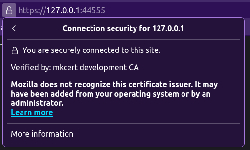

# Develop using HTTPS

To develop locally with HTTPS using a trusted certificate, it is recommended to
use [`mkcert`](https://github.com/FiloSottile/mkcert), which _is a simple tool
for making locally-trusted development certificates_.

- Install [`mkcert`](https://github.com/FiloSottile/mkcert)
- Install the root certificates authority (CA) using the `mkcert --install` command
- Generate a certificate for local development using the command: `mkcert localhost 127.0.0.1 ::1`
- Use the feature of the `ASGI` server you select, to run with HTTPS.
  For `uvicorn`, refer to this documentation: [https://www.uvicorn.org/deployment/#running-with-https](https://www.uvicorn.org/deployment/#running-with-https).

Example:

```bash
mkcert --install

mkcert localhost 127.0.0.1 ::1

uvicorn server:app --port 44555 --ssl-keyfile=./localhost-key.pem --ssl-certfile=./localhost.pem
```


