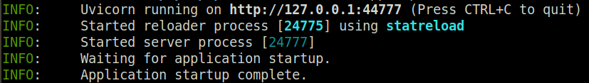
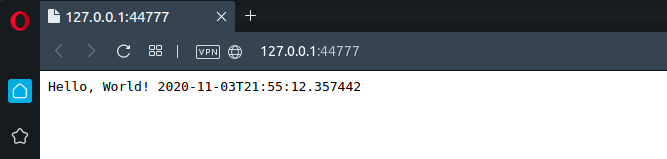

# Getting started with BlackSheep

This tutorial explains how to create and start a minimal BlackSheep web
application. <br> It provides a general view, covering the following topics:

- [X] Creating a web application from scratch.
- [X] Running the web application.
- [X] Configuring routes.
- [X] Handling parameters.
- [X] Handling responses.

### Requirements

* [Python](https://www.python.org) version >= **3.8**
* path to the python executable configured in the environment `$PATH` variable
  (tip: if you install Python on Windows using the official installer, enable
  the checkbox to update your `$PATH` variable during the installation)

### Preparing a development environment

Create a folder in the desired location on your file system, then open a
command line terminal and navigate to the new folder.
Create a virtual environment using the following command:

```
python -m venv venv
```

and activate it:

=== "On Linux or Mac"

    ```
    source venv/bin/activate
    ```

=== "On Windows"

    ```
    venv\Scripts\activate
    ```

BlackSheep belongs to the category of
[ASGI](https://asgi.readthedocs.io/en/latest/) web frameworks, therefore it
requires an ASGI HTTP server to run, such as
[uvicorn](http://www.uvicorn.org/), or
[hypercorn](https://pgjones.gitlab.io/hypercorn/). For this tutorial, install
`uvicorn` together with `blacksheep`:

```bash
pip install blacksheep uvicorn
```

### Creating and running a web application

Create a file `server.py`, and paste the following contents into it:

```python
from datetime import datetime
from blacksheep import Application, get


app = Application()

@get("/")
def home():
    return f"Hello, World! {datetime.now().isoformat()}"
```

Use the command below to start the application using port `44777`, with
automatic reload on file change:

```
uvicorn server:app --port 44777 --reload
```

The terminal should display information like in the picture below:



Open a web browser and navigate to <a href="http://127.0.0.1:44777"
target="_blank">http://127.0.0.1:44777</a>. The web browser will display the
text answer from the web application:



### Configuring routes

The current code configures a request handler for [HTTP GET](https://developer.mozilla.org/en-US/docs/Web/HTTP/Methods/GET)
method at the root path of the application: `"/"`. Note how a function decorator
is used to register the `home` function as request handler:

```python
@get("/")
def home():
    ...
```

This means that whenever a [HTTP GET](https://developer.mozilla.org/en-US/docs/Web/HTTP/Methods/GET) request is received at the root URL of
the application (e.g. http://127.0.0.1:44777), the `home` function is used to
handle the request and produce a response.

To handle more routes and [HTTP methods](https://developer.mozilla.org/en-US/docs/Web/HTTP/Methods), register more request handlers. Update your `server.py` file to contain the
following example, which includes two request handlers: one for `HTTP GET /`,
and one for `HTTP POST /`.

```python
from blacksheep import Application, get, post


app = Application()


@get("/")
def home(request):
    return "GET Example"


@post("/")
def post_example(request):
    return "POST Example"
```

!!! info
    Thanks to `uvicorn`'s auto reload feature (used with `--reload` argument),
    when the `server.py` file is updated, the application is automatically reloaded.
    This is extremely useful during development.

Navigate again to `http://127.0.0.1:44777`, it should display the text:
`"GET Example"`.

To verify that the `post_example` request handler is handling `POST` requests,
use a tool to generate a POST HTTP request at the server's address.
For example, using [`curl`](https://curl.haxx.se):

=== "curl"

    ```bash
    curl -X POST http://127.0.0.1:44777
    ```

=== "PowerShell"

    ```ps1
    Invoke-WebRequest -Uri http://localhost:44777 -Method POST
    ```

!!! info
    The application automatically handles requests for any path that
    is not handled by the router, returning an `HTTP 404 Not Found` response; and
    returns `HTTP 500 Internal Server Error` in case of unhandled exceptions
    happening during code execution.

### Handling route parameters

So far the examples only showed request handlers that didn't use any input
parameter. To define a request handler that uses a route parameter, define
dynamic routes using the following syntax:

```python
@get("/{name}")
def greetings(name):
    return f"Hello, {name}!"
```

Route parameters and function parameter are bound by matching name.
Add the fragment of code above to `server.py` and try navigating to
`http://127.0.0.1:44777/World`.

A route can contain several named parameters, separated by slashes, and
dynamic fragments mixed with static fragments:

```python
@get("/{one}/{two}/{three}")
def multiple_parameters(one, two, three):
    return f"1: {one}, 2: {two}, 3: {three}!"


@get("/movies/{movie_id}/actors/{actor_id}")
def mix(movie_id, actor_id):
    ...
```

Route parameters are by default treated as strings, but BlackSheep supports
automatic parsing of values, when function arguments are annotated using
built-in [`typing` annotations](https://docs.python.org/3/library/typing.html).
For example, to define a route that handles integer route parameters and
returns `HTTP 400 Bad Request` for invalid values, it is sufficient to decorate
the function argument this way:

```python
@get("/lucky-number/{number}")
def only_numbers_here(number: int):
    return f"Lucky number: {number}\n"
```

=== "curl"
    ```
    curl http://127.0.0.1:44777/lucky-number/777
    Lucky number: 777

    curl http://127.0.0.1:44777/lucky-number/x
    Bad Request: Invalid value ['x'] for parameter `number`; expected a valid int.
    ```

=== "PowerShell"
    ```ps1
    Invoke-WebRequest -Uri http://127.0.0.1:44777/lucky-number/777

    StatusCode        : 200
    StatusDescription : OK
    Content           : Lucky number: 777

    Invoke-WebRequest -Uri http://127.0.0.1:44777/lucky-number/x
    Invoke-WebRequest: Bad Request: Invalid value ['x'] for parameter `number`; expected a valid int.
    ```

Several built-in types are handled automatically: e.g. `str`, `bool`, `int`,
`float`, `uuid.UUID`, `datetime.date`, `datetime.datetime`, `List[T]`, `Set[T]`.

### Handling query string parameters

In the same way route parameters are injected automatically into request
handlers by route parameters with matching names, `blacksheep` can handle
query string parameters automatically. Adds this new fragment to your
application:

```python
@get("/query")
def query_greetings(name: str):
    return f"Hello, {name}!"
```

Then navigate to [http://localhost:44777/query?name=World](http://localhost:44777/query?name=World).

---

A request handler can use different query strings, and query string parameters
support lists.

```python
from typing import List

@get("/query-list")
def greetings_many(name: List[str]):
    return f"Hello, {', '.join(name)}!"

# example:
# http://localhost:44777/query-list?name=Charlie&name=Lisa&name=Snoopy
# --> Hello, Charlie, Lisa, Snoopy!
```

Every handler can have many input parameters from different sources: request
headers, cookies, query, route, request body, configured application services.
These are treated in more details in the dedicated page about [Binders](./binders).

### Accessing the request object

To access the HTTP Request object directly, add a parameter called "request" to
the signature of a request handler (type annotation is optional):

```python
from blacksheep import Request

@get("/request-object")
def request_object(request: Request):
    # the request object exposes methods to read headers, cookies,
    # body, route parameters
    ...
```

!!! info
    You can name the request parameter any way you like (e.g. `request`, `req`, `foo`, etc.),
    as long as you keep the correct type annotation (`blacksheep.Request`).

This subject will be treated in more details in a different section.

### Handling responses

Generally speaking, request handlers in BlackSheep must return an instance of
`blacksheep.messages.Response` class. The framework provides several functions
to produce responses for various use cases, defined in the
`blacksheep.server.responses` namespace.

The following example shows how to serve a JSON response, using a class defined
with [`dataclass`](https://docs.python.org/3/library/dataclasses.html). Delete
all contents from the current `server.py` file and paste the following code:

```python
from dataclasses import dataclass
from uuid import UUID, uuid4

from blacksheep import Application, get, json


@dataclass
class Cat:
    id: UUID
    name: str
    active: bool


app = Application()


@get("/api/cats")
def get_cats():
    return json(
        [
            Cat(uuid4(), "Lampo", True),
            Cat(uuid4(), "Milady", True),
            Cat(uuid4(), "Meatball", True),
            Cat(uuid4(), "Pilou", True),
        ]
    )
```

Then navigate to [http://127.0.0.1:44777/api/cats](http://127.0.0.1:44777/api/cats)
to see the result, it will look like this:

```js
[{"id":"9dea0080-0e92-46e0-b090-55454c23d37f","name":"Lampo","active":true},
{"id":"3ce81720-de11-41b4-bad4-6fa63e00403d","name":"Milady","active":true},
{"id":"2981d8a4-52c3-4ed9-96b8-30fafe62bc47","name":"Meatball","active":true},
{"id":"b697358e-0f74-4449-840a-32c8db839244","name":"Pilou","active":true}]
```

Note how the `json` function is used to create an instance of `Response` whose
content is a payload serialized into a JSON string.

```python
from blacksheep import json

response = json({"example": 1})
response.content
<blacksheep.contents.Content object at 0x7f4ebcf30720>

response.content.body
b'{"example":1}'

response.content.length
13
```

!!! tip
    Try also the `pretty_json` function in `blacksheep.server.responses`, which
    returns indented JSON.

For more granular control, it is possible to use the `blacksheep.messages.Response`
class directly (read `blacksheep.server.responses` module for examples), and
it is possible to modify the response before returning it to the client:
for example to set a response header.

```python
@get("/api/cats")
def get_cats():
    response = json(
        [
            Cat(uuid4(), "Lampo", True),
            Cat(uuid4(), "Milady", True),
            Cat(uuid4(), "Meatball", True),
            Cat(uuid4(), "Pilou", True),
        ]
    )

    response.add_header(b"X-Foo", b"Foo!")

    return response
```

However, user defined request handlers can return arbitrary objects, which will
be automatically converted to JSON responses. The example above could also be
written this way:


```python
@get("/api/cats")
def get_cats() -> list[Cat]:
    return [
        Cat(uuid4(), "Lampo", True),
        Cat(uuid4(), "Milady", True),
        Cat(uuid4(), "Meatball", True),
        Cat(uuid4(), "Pilou", True),
    ]
```

The rationale for this design choice is that JSON is the most commonly used
format to serialize objects today, and this feature is useful to reduce code
verbosity while making the return type explicit.

### Asynchronous request handlers
The examples so far showed synchronous request handlers. To define asynchronous
request handlers, define `async` functions:

```python

@get("/api/movies")
async def get_movies():
    # ... do something async (example)
    movies = await movies_provider.get_movies()
    return json(movies)
```

Asynchronous code is described more in other sections of the documentation.

### Summary

This tutorial covered the ABCs of creating a BlackSheep application. The
general concepts presented here apply to any kind of web framework:

- server side routing
- handling of query strings and route parameters
- handling of requests and responses

The next page will describe a more articulated scenario, including handling of
HTML views on the server side, serving static files, and more.

- [Getting started with the MVC project template](../mvc-project-template/)
