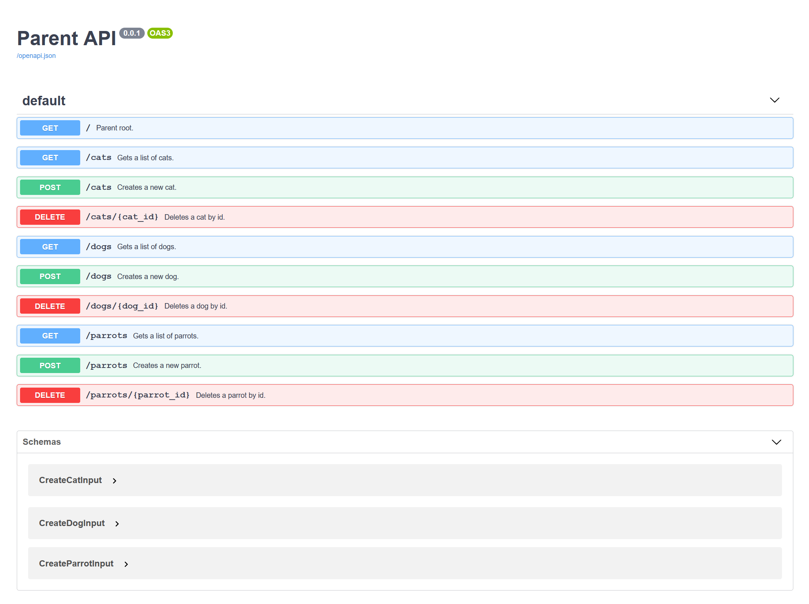

# Mounting applications

The word "mounting" refers to the ability to plug ASGI applications into
others, under specific routes. This enables reusing whole applications, or
components, across web applications. This page describes:

- [X] How to use the mount feature in BlackSheep.
- [X] Details about mounting, and handling of application events.
- [X] Mounting and OpenAPI Documentation.
- [X] An example using [Piccolo Admin](https://github.com/piccolo-orm/piccolo_admin).

## How to use mounts

To mount an application in another application, use the `mount` method:

```python
parent_app.mount("/example-path", child_app)
```

Example:

```python
from blacksheep import Application

parent = Application()


@parent.router.get("/")
def parent_home():
    return "Hello, from the parent app"


child = Application()


@child.router.get("/")
def child_home():
    return "Hello, from the child app"


# Note: when mounting another BlackSheep application,
# make sure to handle the start and stop events of the mounted app
parent.mount_registry.auto_events = True

parent.mount("/sub", child)

```

In the example above, both `parent` and `child` are complete applications that
can be started independently. If `child` is started alone, it replies to GET
web requests at route "/" with the text "Hello, from the child app".

Since `parent` mounts `child` under the path "/sub", when `parent` is started, it
delegates requests starting with `/sub/*` to the mounted application, therefore when the
`parent` is started, a GET request to the route "/sub" produces the greetings message
from `child`. A GET request to the route "/" instead is replied with the text "Hello,
from the parent app".

!!! info
    Try to create a file `server.py` like in the example above, and run the
    applications using `uvicorn`, to verify how they work in practice.

## Side effects of mounting
Even though mounting can enable interesting scenarios, it comes at a price.

Applications that are supposed to be mounted by other applications need to be
designed to be "mount-friendly", for example when they handle redirects or
links to static files they serve. Absolute paths will not work when used by
applications that are mounted by other applications, while relative paths will
work.

If an application is not designed to be mounted by other applications, it might
create non-obvious side effects.

Consider the following example:

```python
from blacksheep import Application, redirect

app_a = Application()


@app_a.router.get("/")
def a_home():
    return "Hello, from Application A"


@app_a.router.get("/test")
def redirect_to_home():
    # Note: app_a defines an absolute path for redirection - this won't work
    # for mounted apps since the intention is most likely to redirect to a path
    # handled by the same application
    return redirect("/")


app_b = Application()


@app_b.router.get("/")
def b_home():
    return "Hello, from Application B"


@app_b.on_start
async def handle_app_a_start(_):
    await app_a.start()


@app_b.on_stop
async def handle_app_a_stop(_):
    await app_a.stop()


app_b.mount("/a", app_a)

```

This won't produce the expected result in real-life scenarios! `app_a` in this
case redirects to the absolute path "/", therefore a path that is handled by
`app_b`! In general, mounted apps will be defined in dedicated packages with
no knowledge of the applications that mount them. To fix this scenario, it is
necessary to use a relative path for redirection, like:

```python
@app_a.router.get("/test")
def redirect_to_home():
    return redirect("./")
```

### Handling of application events
Applications often need to define actions that must happen when the application
starts, and actions that must happen when the application stops.

ASGI web frameworks handle lifecycle events when they get dedicated messages
from the underlying ASGI server (`lifespan` messages), notifying the ASGI
server when initialization logic has completed. However, when an application is
mounted into another, it is not responsible of handling `lifespan` messages.

When mounted apps define initialization and shutdown logic, the application
that mounts them must register their initialization and shutdown functions as
part of its own events.

BlackSheep applications must always be started to work properly. To enable
automatic handling of application events for mounted applications, use of the
following options:

1. use the env variable `APP_MOUNT_AUTO_EVENTS` set to a truthy value ("1", "true",
   "TRUE") - _recommended_
2. set the `parent.mount_registry.auto_events` property to `True`
3. handle application events explicitly like in the example below - necessary
   when the mounted applications are other kinds of ASGI apps

```python
@parent.on_start
async def handle_child_start(_):
    await child.start()


@parent.on_stop
async def handle_child_stop(_):
    await child.stop()


parent.mount("/some-route", child)
```

This ensures that when the main application handles `lifespan` messages from
the ASGI HTTP Server, the mounted app is also notified properly of those
events.

!!! info
    The way the mounted app must be started and stopped depend on the
    web framework used to implement it. The example above is correct when `child`
    is an instance of BlackSheep Application.

!!! danger "Note"
    `APP_MOUNT_AUTO_EVENTS` is not the default to not introduce breaking changes.
    This will be the default behavior in BlackSheep 2.x

## Mounting and OpenAPI Documentation
Since version `1.2.5`, BlackSheep supports generating OpenAPI Documentation
for mounted BlackSheep applications, meaning that parent applications can expose
OpenAPI Documentation about all endpoints, including those of mounted apps and
their descendants.

Example:

```python
from dataclasses import dataclass

from openapidocs.v3 import Info

from blacksheep import Application
from blacksheep.server.openapi.v3 import OpenAPIHandler

parent = Application(show_error_details=True)
parent.mount_registry.auto_events = True
parent.mount_registry.handle_docs = True


docs = OpenAPIHandler(info=Info(title="Parent API", version="0.0.1"))
docs.bind_app(parent)


@dataclass
class CreateCatInput:
    name: str
    email: str
    foo: int


@dataclass
class CreateDogInput:
    name: str
    email: str
    example: int


@dataclass
class CreateParrotInput:
    name: str
    email: str


@parent.router.get("/")
def a_home():
    """Parent root."""
    return "Hello, from the parent app - for information, navigate to /docs"


@parent.router.get("/cats")
def get_cats_conflicting():
    """Conflict!"""
    return "CONFLICT"


child_1 = Application()


@child_1.router.get("/")
def get_cats():
    """Gets a list of cats."""
    return "Gets a list of cats."


@child_1.router.post("/")
def create_cat(data: CreateCatInput):
    """Creates a new cat."""
    return "Creates a new cat."


@child_1.router.delete("/{cat_id}")
def delete_cat(cat_id: str):
    """Deletes a cat by id."""
    return "Deletes a cat by id."


child_2 = Application()


@child_2.router.get("/")
def get_dogs():
    """Gets a list of dogs."""
    return "Gets a list of dogs."


@child_2.router.post("/")
def create_dog(data: CreateDogInput):
    """Creates a new dog."""
    return "Creates a new dog."


@child_2.router.delete("/{dog_id}")
def delete_dog(dog_id: str):
    """Deletes a dog by id."""
    return "Deletes a dog by id."


child_3 = Application()


@child_3.router.get("/")
def get_parrots():
    """Gets a list of parrots."""
    return "Gets a list of parrots"


@child_3.router.post("/")
def create_parrot(data: CreateParrotInput):
    """Creates a new parrot."""
    return "Creates a new parrot"


@child_3.router.delete("/{parrot_id}")
def delete_parrot(parrot_id: str):
    """Deletes a parrot by id."""
    return "Deletes a parrot by id."


parent.mount("/cats", child_1)
parent.mount("/dogs", child_2)
parent.mount("/parrots", child_3)
```

Produces OpenAPI Documentation for all endpoints.



## Examples
To see a working example where `mount` is used, see [the Piccolo Admin example
at
_BlackSheep-Examples_](https://github.com/Neoteroi/BlackSheep-Examples/tree/main/piccolo-admin).

In this example, [Piccolo Admin](https://github.com/piccolo-orm/piccolo_admin)
is configured as mounted app under "/admin" route, providing a UI to handle
data stored in a `SQLite` database.
