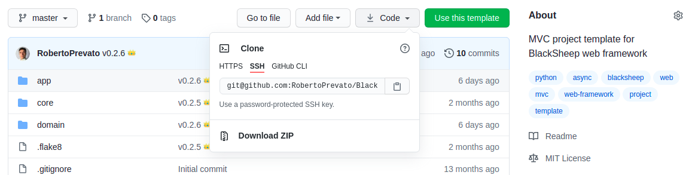
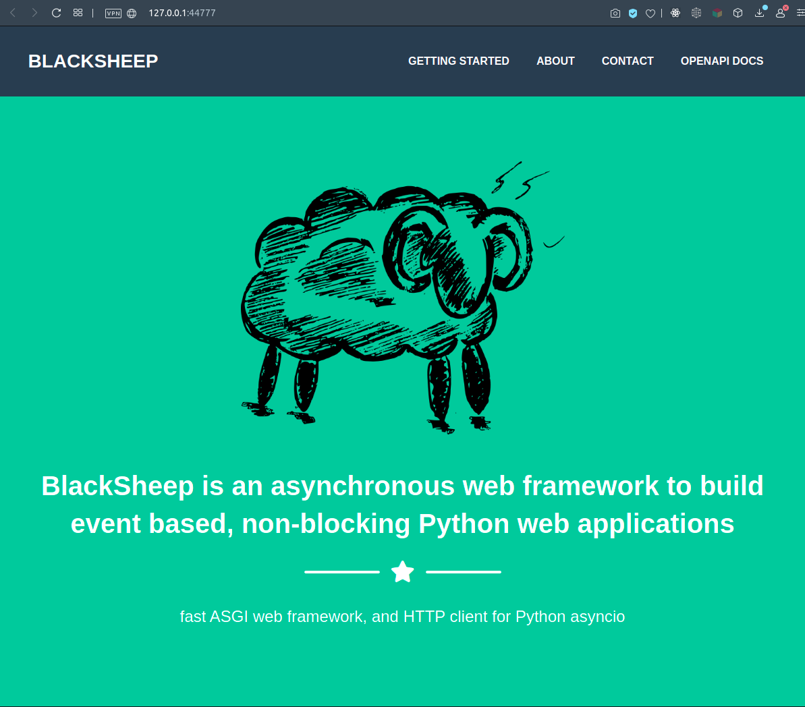
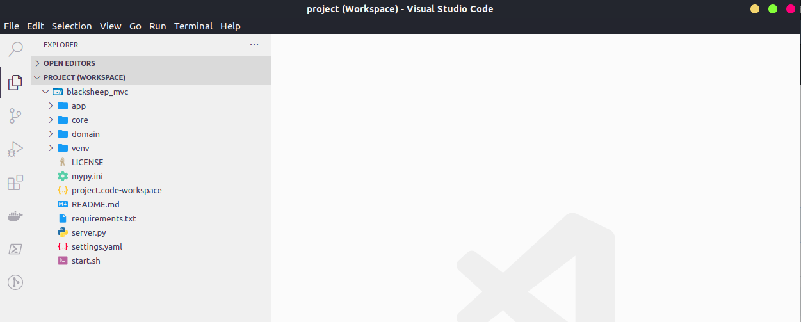
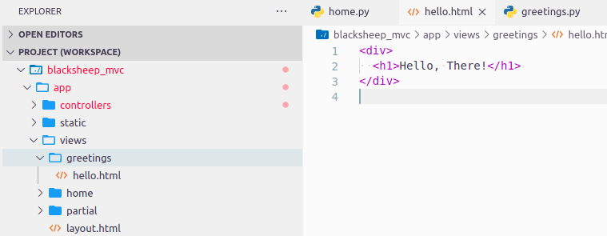
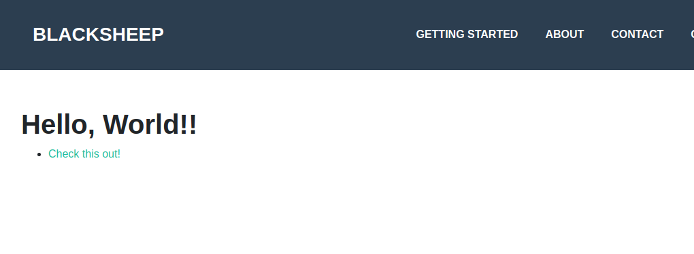

# Getting started with the MVC project template
This tutorial explains how to create a BlackSheep application using the
MVC ([_Model, View, Controller_](https://en.wikipedia.org/wiki/Model–view–controller))
project template, covering the following topics:

<div class="check-list"></div>
* Creating a blacksheep application from a project template.
* Routes defined using classes (controllers).
* Server side templating (views and models).
* Handling parameters in controllers.
* Serving static files

It is recommended to follow the [previous tutorial](../getting-started) before
reading this one.

### Requirements

* [Python](https://www.python.org) version **3.7**, **3.8**, **3.9**, or **3.10**
* path to the python executable configured in the environment `$PATH` variable
  (tip: if you install Python on Windows using the official installer, enable
  the checkbox to update your `$PATH` variable automatically)
* a text editor: any is fine; this tutorial uses [Visual Studio Code](https://code.visualstudio.com/Download)

## Downloading the project template
Navigate to [the BlackSheep MVC project template repository in GitHub](https://github.com/RobertoPrevato/BlackSheepMVC)
and download its code in one of the following ways:

* either clone the repository using [`git`](https://git-scm.com)
* or download the project as zip file, using the _"Download ZIP"_ button, and unzip the contents into the desired location



!!! info
    If you have a GitHub account, you can use the _"Use this template"_ button to create a new project, then clone it.

Then create a Python virtual environment as explained in the [previous
tutorial](./getting-started/#preparing-a-development-environment), for example
at the root folder of the project template, and install the dependencies of the
project template, using the following command:

```
pip install -r requirements.txt
```

## Starting the application
Start the application using the following command:

```
uvicorn server:app --port 44777 --reload
```

And navigate to the local page, opening a browser at [`http://localhost:44777`](http://localhost:44777)
(use the same port of the previous command).

The browser should display this page:



Several things are happening because the web application is configured:

* to build and serve dynamic HTML pages
* to serve static files (e.g. pictures, JavaScript, CSS files)
* to expose an API and offer OpenAPI Documentation about the API
* to handle application settings and application start/stop events

Let's see these elements in order, but first let's get acquainted with the
project's structure.

## Project structure
The project is organized with the following folder structure:

```
├── app
│   ├── (application files related to blacksheep front-end)
│   │
│   ├── controllers
│   │   └── (controller files, defining routes)
│   │
│   ├── static
│   │   └── (static files served by the web app)
│   │
│   └── views
│       └── (HTML templates, views compiled by the web app)
│
├── core
│   └── (core classes, common across front-end and business layer)
│
├── domain
│   └── (domain classes, POCO)
│
├── (root folder, where the main file starting the whole app resides)
├── server.py
└── settings.yaml
```

* the `app` folder contains files that are specific to the web application,
  settings, configuration, a folder for `controllers` that define routes,
  folders for `static` files and one for `views` (HTML templates)
* other packages at the root of the project, like `core` and `domain`, should be
  abstracted from the web server and should be reusable in other kinds of
  applications (for example, a CLI)
* the root folder contains the `server.py` file to start the application, and
  a `settings.yaml` file that is loaded when the application process starts, to
  read settings for the application

The project uses `onion architecture`. For example a valid scenario would be
to add an additional package for the data access layer, and implement the
business logic in sub-packages inside the `domain` folder.

The root folder also contains a LICENSE file: this refers to the project
template itself and can be deleted, a `mypy.ini` file for those who use
[`MyPy`](http://www.mypy-lang.org), and a workspace file for `Visual Studio Code`,
for developers who use this text editor.

## Open the project with a text editor
Open the project's folder using your favorite text editor. The template
includes a workspace file for `Visual Studio Code`, which contains recommended
settings to work with Python (recommended extensions, and [`black`](https://github.com/psf/black) formatter, [`flake8`](https://flake8.pycqa.org/en/latest/),
[`mypy`](http://www.mypy-lang.org), and [`pylance`](https://marketplace.visualstudio.com/items?itemName=ms-python.vscode-pylance)).
These are of course a matter of personal preference and can be ignored or removed.



## Routes defined using classes (controllers)
The previous tutorial described how routes can be defined using functions:

```python
@app.route("/")
async def home():
    ...
```

`blacksheep` offers an alternative way to define request handlers: using class
methods. Both approaches have pros and cons, which will be described later in
more detail. To see this in practice, create a new file
`app/controllers/greetings.py` and copy the following code into it:

```python
from blacksheep.server.controllers import Controller, get


class Greetings(Controller):

    @get("/hello-world")
    def index(self):
        return self.text("Hello, World!")

```

Finally, open `app/controllers/__init__.py` and import the new controller,
adding this line to it:

```python
from .greetings import Greetings
```

If the application was run using the `--reload` option, its process should
reload automatically; otherwise stop and restart the application manually. <br>
Navigate to [`http://localhost:44777/hello-world`](http://localhost:44777/hello-world):
it will display the response from the `Greetings.index` method.

When the path of a web request matches a route defined in a controller type, a
new instance of that `Controller` is created. In other words, every instance of controller is scoped to a specific web request. Just like function handlers,
controllers support automatic injection of parameters into request handlers, and
also dependency injection into their constructors (`__init__` methods). This is
an excellent feature that improves development speed and enables cleaner code
(compare this approach with a scenario where all dependencies needs to be imported
 and referenced inside function bodies by hand).

The `Controller` class implements methods to return values and offers
`on_request` and `on_response` extensibility points.

## Server side templating (views and models)
Server side templating refers to the ability of a web application to generate
HTML pages from templates and dynamic variables. BlackSheep does this
using the wondeful [`Jinja2` library](https://palletsprojects.com/p/jinja/)
by the [Pallets](https://palletsprojects.com) team.

To see how this works in practice when using `Controllers`, add a new method to
the new `Greetings` controller created previously to look like this:

```python
from blacksheep.server.controllers import Controller, get


class Greetings(Controller):

    @get("/hello-view")
    def hello(self):
        return self.view()
```

Then, create a new folder inside `views` directory, called "greetings", and
add an HTML file named "hello.html".



Copy the following contents into the `hello.html`:

```html
<div>
  <h1>Hello, There</h1>
</div>
```

Now navigate to [http://localhost:44777/hello-view](http://localhost:44777/hello-view),
to see the response from the new HTML view.

Note how convention over configuration is used in this case, to determine that
`./views/greetings/hello.html` file must be used, because of the convention:
`./views/{CONTROLLER_NAME}/{METHOD_NAME}.html`.

The view currently is an HTML fragment, not a full document. To make it a
full page, modify `hello.html` to use the application layout:

```html


  Hello Page!


  Project template to create web applications with MVC architecture using BlackSheep web framework.


  <link rel="stylesheet" href="/styles/public.css" />


  <div style="margin: 10em 2em;">
    <h1>Hello, There!</h1>
  </div>




```

Refresh the page at [http://localhost:44777/hello-view](http://localhost:44777/hello-view) to see the result.

In this case, a page layout is applied using: ``,
with several blocks going in various area of `layout.html`. For more information
on layouts and features of the templating library, refer to
[Jinja2 documentation](https://jinja2docs.readthedocs.io/en/stable/).

---

So far the tutorials only showed the _Controller_ and the _View_ part of the _MVC_ architecture. A _Model_ is a context for an HTML view.
To include dynamic content into an HTML template, use mustaches _`{{name}}`_
placeholders and pass a model having properties whose names match their key
to the `view` function.

For example, modify `hello.html` to use dynamic content from a model:

```html
  <div style="margin: 10em 2em;">
    <h1>Hello, {{name}}!</h1>

    <ul>
      
        <li><a href="{{ sentence.url }}">{{ sentence.text }}</a></li>
      
    </ul>
  </div>
```

and `greetings.py` to contain the following code:

```python
from dataclasses import dataclass
from typing import List
from blacksheep.server.controllers import Controller, get


@dataclass
class Sentence:
    text: str
    url: str


@dataclass
class HelloModel:
    name: str
    sentences: List[Sentence]


class Greetings(Controller):

    @get("/hello-view")
    def hello(self):
        return self.view(
            model=HelloModel(
                "World!",
                sentences=[
                    Sentence(
                        "Check this out!",
                        "https://github.com/RobertoPrevato/BlackSheep",
                    )
                ],
            )
        )
```

Produces this result:


Models can be defined as [dictionaries](https://docs.python.org/3.9/library/stdtypes.html#dict),
[dataclasses](https://docs.python.org/3/library/dataclasses.html),
[pydantic models](https://pydantic-docs.helpmanual.io), or regular classes
implementing a constructor.

## Handling parameters in controllers
The previous tutorial showed how request handlers support automatic injection
of parameters read from the HTTP request. Controllers support the same,
therefore it is possible to have parameters read automatically and injected
to controller methods:

```python
class Example(Controller):

    @get("/example/{value}")
    def route_example(self, value: str):
        return self.text(f"Got: {value} in route")

    @get("/example")
    def query_example(self, value: str):
        return self.text(f"Got: {value} in query string")
```

Additionally, controllers support automatic injection of parameters in their
constructor:

```python
class Example(Controller):

    @get("/example/{value}")
    def route_example(self, value: str):
        return self.text(f"Got: {value} in route")

    @get("/example")
    def query_example(self, value: str):
        return self.text(f"Got: {value} in query string")
```

Controllers also support dependency injection for their constructor
(`__init__` method), this will be explained in the next page.

## Serving static files
This tutorial previously showed how the homepage of the MVC project template looks
like, at the root of the web site:


The project template includes a folder for `static` files, including pictures,
CSS, JavaScript files. Static files are served using a catch-all route, reading
files whose path, relatively to the static folder, matches the URL path of the request.

For example, if the `static` folder contains such file: `scripts/example.js`,
web requests at `http://localhost:44777/scripts/example.js` will be resolved
with this file and related information. When handling static files, BlackSheep
automatically takes care of several details:

* it handles ETag response header, If-None-Match request header and HTTP 304 Not Modified
  responses if files don't change on file system
* it handles HTTP GET requests returning file information
* it handles Range requests, to support pause and restore downloads out of the box
  and enable optimal support for videos (videos can be downloaded from a certain
  point in time)

Try to add a file to the static folder, and download it writing the path in your
browser.

Relative paths are supported, but only files inside the root static folder are
served, it is not possible to download files outside of the static folder (it would be
a security issue if it worked otherwise!).
Additionally, BlackSheep only handles certain files extensions:  by default
only the most common file extensions used in web applications.
Paths starting with "/" are always considered absolute paths starting from the
root of the web site.

## Summary
This tutorial covered some higher level topics of a BlackSheep application. The
general concepts presented here apply to many kinds of web framework:

* server side templating of HTML views
* serving of static files
* use of MVC architecture

The next pages describes the built-in support for
[dependency injection](../dependency-injection), and automatic generation of
[OpenAPI Documentation](../openapi).
