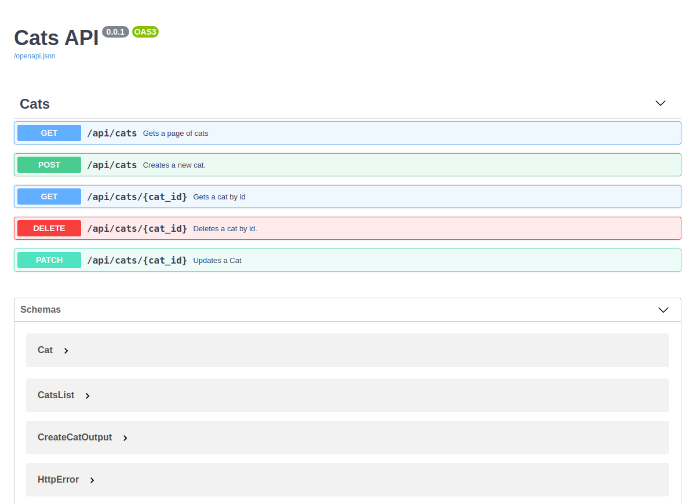
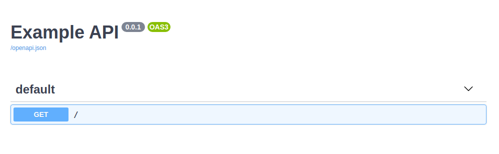
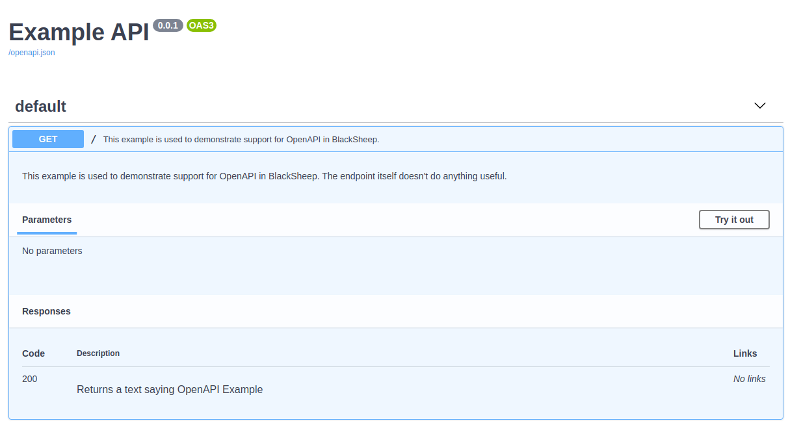
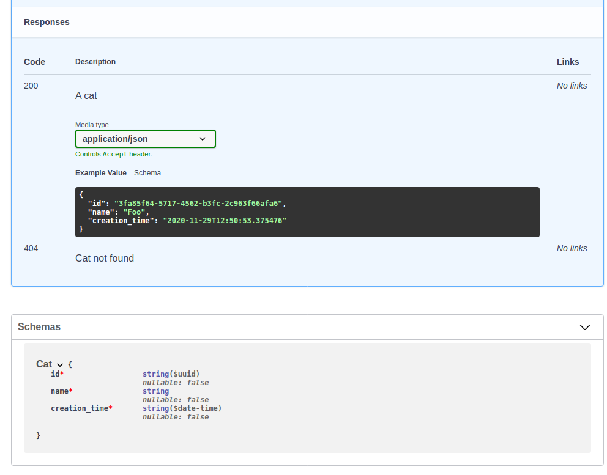

# OpenAPI Documentation
BlackSheep implements automatic generation of OpenAPI Documentation for most
common scenarios, and provides methods to enrich the documentation with
details. This page describes the following:

<div class="check-list"></div>
* An introduction to OpenAPI Documentation.
* Built-in support for OpenAPI Documentation.
* How to document endpoints.
* How to handle common responses.
* Expose the documentation for anonymous access.
* Support for [ReDoc UI](https://github.com/Redocly/redoc).

## Introduction to OpenAPI Documentation
Citing from the [Swagger web site](https://swagger.io/specification/), at the
time of this writing:

> The OpenAPI Specification (OAS) defines a standard {...}
> interface to RESTful APIs which allows both humans and computers to discover
> and understand the capabilities of the service {...}.
>
> An OpenAPI definition can then be used by documentation generation tools to
> display the API, code generation tools to generate servers and clients in
> various programming languages, testing tools, and many other use cases.

Since a web application knows by definition the paths it is handling, and since
a certain amount of metadata can be inferred from the source code, BlackSheep
implements automatic generation of OpenAPI Documentation, and offers an API
to enrich the documentation with information that cannot be inferred from the
source code.

If you followed the [Getting started: MVC](./mvc-project-template) tutorial,
its project template is configured to include an example of OpenAPI
Documentation and to expose a Swagger UI at `/docs` path.



## Built-in support for OpenAPI Documentation

The following piece of code describes a minimal set-up to enable generation of
OpenAPI Documentation and exposing a Swagger UI in BlackSheep:

```python
from dataclasses import dataclass

from blacksheep.server import Application
from blacksheep.server.openapi.v3 import OpenAPIHandler
from openapidocs.v3 import Info

app = Application()

docs = OpenAPIHandler(info=Info(title="Example API", version="0.0.1"))
docs.bind_app(app)


@dataclass
class Foo:
    foo: str


@app.route("/foo")
async def get_foo() -> Foo:
    return Foo("Hello!")
```

If you start this application and navigate to its `/docs` route, you will see
a Swagger UI like this:



---

In this example, BlackSheep generates this specification file in JSON format,
at `/openapi.json` path:

```json
{
    "openapi": "3.0.3",
    "info": {
        "title": "Example API",
        "version": "0.0.1"
    },
    "paths": {
        "/foo": {
            "get": {
                "responses": {
                    "200": {
                        "description": "Success response",
                        "content": {
                            "application/json": {
                                "schema": {
                                    "$ref": "#/components/schemas/Foo"
                                }
                            }
                        }
                    }
                },
                "operationId": "get_foo"
            }
        }
    },
    "servers": [],
    "components": {
        "schemas": {
            "Foo": {
                "type": "object",
                "required": [
                    "foo"
                ],
                "properties": {
                    "foo": {
                        "type": "string",
                        "nullable": false
                    }
                }
            }
        }
    }
}
```

Note how the `Foo` component schema is automatically documented. `BlackSheep`
supports both `@dataclass` and `Pydantic` models for automatic generation of
documentation.

And also YAML format at `/openapi.yaml` path:

```yaml
openapi: 3.0.3
info:
    title: Example API
    version: 0.0.1
paths:
    /foo:
        get:
            responses:
                '200':
                    description: Success response
                    content:
                        application/json:
                            schema:
                                $ref: '#/components/schemas/Foo'
            operationId: get_foo
servers: []
components:
    schemas:
        Foo:
            type: object
            required:
            - foo
            properties:
                foo:
                    type: string
                    nullable: false
```

To provide more details for api routes, decorate request handlers using the
instance of `OpenAPIHandler` as a decorator:

```python

@docs(responses={200: "Returns a text saying OpenAPI Example"})
@app.route("/")
def home():
    return "OpenAPI Example"
```

After this change, the specification file includes the new information:

```yaml
openapi: 3.0.3
info:
    title: Example API
    version: 0.0.1
paths:
    /:
        get:
            responses:
                '200':
                    description: Returns a text saying OpenAPI Example
            operationId: home
components: {}
```

### Adding description and summary
An endpoint description can be specified either using a `docstring`:

```python
@docs(responses={200: "Returns a text saying OpenAPI Example"})
@app.route("/")
async def home():
    """
    This example is used to demonstrate support for OpenAPI in BlackSheep.
    The endpoint itself doesn't do anything useful.
    """
    return "OpenAPI Example"
```

Or in the `@docs` decorator:
```python
@docs(
    summary="This example is used to demonstrate support for OpenAPI in BlackSheep.",
    description="The endpoint itself doesn't do anything useful.",
    responses={200: "Returns a text saying OpenAPI Example"},
)
@app.route("/")
async def home():
    return "OpenAPI Example"
```

When using `docstring`, the first line of the docstring is used as summary,
and the whole docstring as description.



> **Note:** most of the BlackSheep code base is typed using the `typing` module,
> thus IDEs and text editors like Visual Studio Code and PyCharm can provide
> user's friendly hints for code completion (see the screenshot below).


### Ignoring endpoints

To exclude certain endpoints from the API documentation, use `@docs.ignore()`:

```python
@docs.ignore()
@app.route("/hidden-from-docs")
async def hidden_endpoint():
    return "This endpoint won't appear in documentation"
```

### Document only certain routes

To document only certain routes, use an include function like in the example below.
For example, to include only those routes that starts with "/api":

```python
docs = OpenAPIHandler(info=Info(title="Example API", version="0.0.1"))

# include only endpoints whose path starts with "/api/"
docs.include = lambda path, _: path.startswith("/api/")
```

### Documenting response examples

The following example shows how to describe examples for responses:

```python
from dataclasses import dataclass
from datetime import datetime
from uuid import UUID

from blacksheep.server import Application
from blacksheep.server.openapi.common import ContentInfo, ResponseExample, ResponseInfo
from blacksheep.server.openapi.v3 import OpenAPIHandler
from blacksheep.server.responses import json
from openapidocs.v3 import Info

app = Application()

docs = OpenAPIHandler(info=Info(title="Example API", version="0.0.1"))
docs.bind_app(app)


@dataclass
class Cat:
    id: UUID
    name: str
    creation_time: datetime


@docs(
    summary="Gets a cat by id",
    description="""A sample API that uses a petstore as an
          example to demonstrate features in the OpenAPI 3 specification""",
    responses={
        200: ResponseInfo(
            "A cat",
            content=[
                ContentInfo(
                    Cat,
                    examples=[
                        ResponseExample(
                            Cat(
                                id=UUID("3fa85f64-5717-4562-b3fc-2c963f66afa6"),
                                name="Foo",
                                creation_time=datetime.now(),
                            )
                        )
                    ],
                )
            ],
        ),
        404: "Cat not found",
    },
)
@app.route("/api/cats/{cat_id}")
def get_cat_by_id(cat_id: UUID):
    cat = ...  # TODO: implement the logic that fetches a cat by id
    return json(cat)

```

If the code seems excessively verbose, consider that OpenAPI specification is
designed to support documenting responses with different content types (e.g.
JSON, XML, etc.) and having examples for each content type. Writing the
documentation by hand would be much more time consuming!

BlackSheep automatically generates components schemas by type (in this example,
`Cat`) and reuses them in all API endpoints that use them:



### Avoid code pollution using EndpointDocs

If you are familiar with other libraries to produce OpenAPI Documentation and
you consider the example above, you might notice that adding OpenAPI details to
request handlers can pollute the source code and distract the programmer from
the actual request handlers' logic.

BlackSheep provides a way to avoid polluting the source code and keep the code
for OpenAPI in dedicated files. Use the `blacksheep.server.openapi.common.EndpointDocs`
class to define documentation in dedicated files and keep your request handlers
code clean:

```python
from apidocs.cats import get_cat_docs

@docs(get_cat_docs)
@app.route("/api/cats/{cat_id}")
def get_cat_by_id(cat_id: UUID):
    cat = ...  # TODO: implement the logic that fetches a cat by id
    return json(cat)
```

To see a complete example, refer to the source code of the [MVC project
template](https://github.com/RobertoPrevato/BlackSheepMVC), and see how
documentation is organized and configured (in `app.docs`, `app.controllers.docs`).

### Deprecating an API

To mark and endpoint as deprecated, use `@docs.deprecated()`:

```python
@docs.deprecated()
@app.route("/some-deprecated-api")
async def deprecated_endpoint():
    return "This endpoint is deprecated"
```

### Altering the specification upon creation

To alter the specification file upon creation, define a subclass of
`OpenAPIHandler` that overrides `on_docs_generated` method.

```python
from blacksheep.server import Application
from blacksheep.server.openapi.v3 import OpenAPIHandler
from blacksheep.server.responses import json
from openapidocs.v3 import Info, OpenAPI, Server

app = Application()


class MyOpenAPIHandler(OpenAPIHandler):
    def on_docs_generated(self, docs: OpenAPI) -> None:
        docs.servers = [
            Server(url="https://foo-example.org"),
            Server(url="https://test.foo-example.org"),
        ]


docs = MyOpenAPIHandler(info=Info(title="Example API", version="0.0.1"))
docs.bind_app(app)
```

### Handling common responses

APIs often implement a common way to handle failures, to provide clients with
details for web requests that cannot complete successfully. For example, an API
might return a response body like the following, in case of a bad request for
a certain endpoint:

```json
{"error": "The provided country code is not supported", "code": "InvalidCountryCode"}
```

Such response body can be handled using a `dataclass`:

```python
from dataclasses import dataclass


@dataclass
class ErrorInfo:
    error: str
    code: int
```

`blacksheep` offers the following way to document common responses:

```python
from openapidocs.v3 import MediaType, Response as ResponseDoc, Schema


error_info = docs.register_schema_for_type(ErrorInfo)

docs.common_responses = {
    400: ResponseDoc(
        "Bad request",
        content={
            "application/json": MediaType(
                schema=Schema(
                    any_of=[error_info],
                    example=SafeException(error="Invalid argument", code=1001),
                )
            )
        },
    ),
    401: ResponseDoc(
        "Unauthorized",
        content={
            "application/json": MediaType(
                schema=Schema(
                    any_of=[error_info],
                    example=SafeException(
                        error="The user is not authorized", code=3
                    ),
                )
            )
        },
    ),
}
```

Common responses are configured for all endpoints.


### Support for generics

The generation of OpenAPI Documentation supports handling of [generic
types](https://docs.python.org/3/library/typing.html#typing.Generic). Consider
the following example:

1. a common task is to implement an API that returns a paginated subset of
   elements, usually given some filters (e.g. textual search)
2. clients needs to know the count of items that match the filters, to display
   the total number of items and the number of pages that are necessary to
   display all results (depending on page size)
3. for such scenario, using a `Generic` like is a good solution, because many
   kinds of objects can be paginated

_Example of generic class definition_

```python
from dataclasses import dataclass
from typing import List, Generic, TypeVar


T = TypeVar("T")


@dataclass
class PaginatedSet(Generic[T]):
    items: List[T]
    total: int
```

_Full example illustrating OpenAPI Documentation for generics_

```python
from dataclasses import dataclass
from datetime import datetime
from typing import Generic, List, TypeVar
from uuid import UUID

from openapidocs.v3 import Info

from blacksheep.server import Application
from blacksheep.server.bindings import FromQuery
from blacksheep.server.openapi.v3 import OpenAPIHandler

T = TypeVar("T")


@dataclass
class PaginatedSet(Generic[T]):
    items: List[T]
    total: int


@dataclass
class Order:
    id: UUID
    customer_id: UUID
    creation_time: datetime


app = Application()


# enable OpenAPI Documentation
docs = OpenAPIHandler(info=Info(title="Example", version="0.0.1"))
docs.bind_app(app)


@app.router.get("/api/orders")
async def get_orders(
    page: FromQuery[int] = FromQuery(1),
    page_size: FromQuery[int] = FromQuery(30),
    search: FromQuery[str] = FromQuery(""),
) -> PaginatedSet[Order]:
    """
    Returns a paginated set of orders.
    """

```

In the example below, the generic type is handled properly and produces the
following OpenAPI Documentation:

```yaml
openapi: 3.0.3
info:
    title: Example
    version: 0.0.1
paths:
    /api/orders:
        get:
            responses:
                '200':
                    description: Success response
                    content:
                        application/json:
                            schema:
                                $ref: '#/components/schemas/PaginatedSetOfOrder'
            operationId: get_orders
            summary: Returns a paginated set of orders.
            description: Returns a paginated set of orders.
            parameters:
            -   name: page
                in: query
                schema:
                    type: integer
                    format: int64
                    nullable: false
                description: ''
            -   name: page_size
                in: query
                schema:
                    type: integer
                    format: int64
                    nullable: false
                description: ''
            -   name: search
                in: query
                schema:
                    type: string
                    nullable: false
                description: ''
servers: []
components:
    schemas:
        Order:
            type: object
            required:
            - id
            - customer_id
            - creation_time
            properties:
                id:
                    type: string
                    format: uuid
                    nullable: false
                customer_id:
                    type: string
                    format: uuid
                    nullable: false
                creation_time:
                    type: string
                    format: date-time
                    nullable: false
        PaginatedSetOfOrder:
            type: object
            required:
            - items
            - total
            properties:
                items:
                    type: array
                    nullable: false
                    items:
                        $ref: '#/components/schemas/Order'
                total:
                    type: integer
                    format: int64
                    nullable: false
```

> **Note:** generic types, expressed in Python using `GenericType[T]`, are
> represented with `GenericTypeOfT` to respect OpenAPI specification, saying
> that `$ref values must be RFC3986-compliant percent-encoded URIs`.
> A generic type with more arguments, like `Foo[T, U, X]` gets represented with
> `FooOfTAndUAndX`.

### Describing parameters
It is possible to describe parameters explicitly, or using docstrings.

#### Documenting parameters explicitly

To document parameters explicitly, use the `@docs` like in the following
example (elaborating on the previous example about generics):

```python
from blacksheep.server.openapi.common import ParameterInfo


app = Application()


# enable OpenAPI Documentation
docs = OpenAPIHandler(info=Info(title="Example", version="0.0.1"))
docs.bind_app(app)


@app.router.get("/api/orders")
@docs(
    parameters={
        "page": ParameterInfo(description="Page number"),
        "page_size": ParameterInfo(
            description="The number of items to display per page"
        ),
        "search": ParameterInfo(description="Optional text search"),
    },
)
async def get_orders(
    page: FromQuery[int] = FromQuery(1),
    page_size: FromQuery[int] = FromQuery(30),
    search: FromQuery[str] = FromQuery(""),
) -> PaginatedSet[Order]:
    """
    Returns a paginated set of orders.
    """
```

#### Documenting parameters using docstrings

BlackSheep supports documenting parameters using docstrings, and the following
styles are supported:
* Epytext
* ReStructuredText
* NumpyDoc

The following sections show the previous example re-written to use docstrings
in the various styles.

**Epytext**

```python

@app.router.get("/api/orders")
async def get_orders(
    page: FromQuery[int] = FromQuery(1),
    page_size: FromQuery[int] = FromQuery(30),
    search: FromQuery[str] = FromQuery(""),
) -> PaginatedSet[Order]:
    """
    Returns a paginated set of orders.

    @param page: Page number
    @param page_size: The number of items to display per page
    @param search: Optional text search
    """

```

**ReStructuredText**

```python

@app.router.get("/api/orders")
async def get_orders(
    page: FromQuery[int] = FromQuery(1),
    page_size: FromQuery[int] = FromQuery(30),
    search: FromQuery[str] = FromQuery(""),
) -> PaginatedSet[Order]:
    """
    Returns a paginated set of orders.

    :param page: Page number
    :param page_size: The number of items to display per page
    :param search: Optional text search
    """
```

**NumpyDoc**

```python

@app.router.get("/api/orders")
async def get_orders(
    page: FromQuery[int] = FromQuery(1),
    page_size: FromQuery[int] = FromQuery(30),
    search: FromQuery[str] = FromQuery(""),
) -> PaginatedSet[Order]:
    """
    Returns a paginated set of orders.

    Parameters
    ----------
    page : Page number
    page_size : The number of items to display per page
    search : Optional text search
    """
```


The logic that parses docstrings can also extract types information, but this
is not documented because the recommended way is to use type annotations.
Refer to the file `test_openapi_docstrings.py` for more examples on the
information that can be extracted from docstrings.

### Anonymous access

If the server uses a default authorization policy that requires an
authenticated user, it is still possible to make the OpenAPI Documentation
endpoint available for anonymous access, using the `anonymous_access`
parameter:

```python
from blacksheep.server.openapi.v3 import OpenAPIHandler
from openapidocs.v3 import Info

docs = OpenAPIHandler(
    info=Info(title="Example API", version="0.0.1"), anonymous_access=True
)

# include only endpoints whose path starts with "/api/"
docs.include = lambda path, _: path.startswith("/api/")
```

### Support for ReDoc UI

BlackSheep supports [ReDoc UI](https://github.com/Redocly/redoc), although
this is disabled by default. It is also possible to implement custom UIs for
the documentation endpoints, using the `ui_providers` property of the
`OpenAPIHandler` class, and implementing a custom `UIProvider`.

```python
from blacksheep.server.openapi.v3 import OpenAPIHandler
from blacksheep.server.openapi.ui import ReDocUIProvider
from openapidocs.v3 import Info

docs = OpenAPIHandler(
    info=Info(title="Example API", version="0.0.1"),
)

docs.ui_providers.append(ReDocUIProvider())

# include only endpoints whose path starts with "/api/"
docs.include = lambda path, _: path.startswith("/api/")
```

### For more details
For more details on the OpenAPI specification and understand some details such
as security settings, refer to the official [swagger.io web
site](https://swagger.io/specification/), and the dedicated library to generate
the specification file:
[essentials-openapi](https://github.com/Neoteroi/essentials-openapi).
