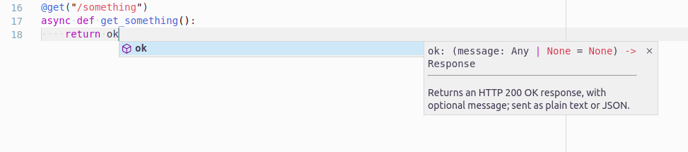

# Responses
This page describes:

- [X] How responses are handled.
- [X] Helper functions to handle responses.
- [X] Responses using asynchronous generators.

## The Response class
A normal request handler in BlackSheep is expected to return an instance of
the `blacksheep.Response` class. Users of the framework can define
request handlers that return different kinds of objects. In such cases they are
normalized at application start-up to return instances of `Response`.

The following example shows how to use the low-level objects to create a
response with status 200 and body "Hello, World":

```python
from blacksheep import Application, Response, Content, get

app = Application()


@get("/")
def home() -> Response:
    return Response(200, content=Content(b"text/plain", b"Hello, World!"))

```

`BlackSheep` uses these exact types to benefit from static typing and
compilation of [`Cython` extensions](https://cython.org). However, handling
responses this way is not comfortable for regular use. For this reason, a
number of helper functions are provided to create `Response` objects with a
simpler code API.

For example, the `json` function in `blacksheep.server.responses` produces
a response object having a JSON body.

```python
from blacksheep import Application, get, json

app = Application()


@get("/")
def home():
    return json({"message": "Hello, World!"})
```

Produces the following response body:

```json
{"message":"Hello, World!"}
```

---

The framework also allows to define a request handler this way:

```python
from blacksheep import Application, get

app = Application()


@get("/")
def home():
    return {"message": "Hello, World!"}
```

Note that, when a request handler doesn't specify a `Response` return type with
type annotations, the framework checks the function's return type at each call
(causing a small performance fee!), and automatically prepares a `Response`
if necessary.

## Functions in `blacksheep.server.responses`

!!! info
    Note that you can import these functions from the `blacksheep` package itself.

The table below describes the built-in functions to produce responses:

| Method                 | Description                                                                                                                                                                                                       |
| ---------------------- | ----------------------------------------------------------------------------------------------------------------------------------------------------------------------------------------------------------------- |
| **ok**                 | Returns an HTTP 200 OK response, with an optional message; sent as plain text or JSON.                                                                                                                            |
| **status_code**        | Returns a plain response with the given status, and with an optional message; sent as plain text or JSON.                                                                                                         |
| **created**            | Returns an HTTP 201 Created response, to the given location and with optional JSON content.                                                                                                                       |
| **accepted**           | Returns an HTTP 202 Accepted response, with an optional message; sent as plain text or JSON.                                                                                                                      |
| **no_content**         | Returns an HTTP 204 No Content response.                                                                                                                                                                          |
| **json**               | Returns a response with application/json content, and the given status (default HTTP 200 OK).                                                                                                                     |
| **pretty_json**        | Returns a response with indented application/json content, and the given status (default HTTP 200 OK).                                                                                                            |
| **text**               | Returns a response with text/plain content, and the given status (default HTTP 200 OK).                                                                                                                           |
| **moved_permanently**  | Returns an HTTP 301 Moved Permanently response, to the given location.                                                                                                                                            |
| **redirect**           | Returns an HTTP 302 Found response (commonly called redirect), to the given location.                                                                                                                             |
| **see_other**          | Returns an HTTP 303 See Other response, to the given location.                                                                                                                                                    |
| **not_modified**       | Returns an HTTP 304 Not Modified response.                                                                                                                                                                        |
| **temporary_redirect** | Returns an HTTP 307 Temporary Redirect response, to the given location.                                                                                                                                           |
| **permanent_redirect** | Returns an HTTP 308 Permanent Redirect response, to the given location.                                                                                                                                           |
| **bad_request**        | Returns an HTTP 400 Bad Request response, with an optional message; sent as plain text or JSON.                                                                                                                   |
| **unauthorized**       | Returns an HTTP 401 Unauthorized response, with an optional message; sent as plain text or JSON.                                                                                                                  |
| **forbidden**          | Returns an HTTP 403 Forbidden response, with an optional message; sent as plain text or JSON.                                                                                                                     |
| **not_found**          | Returns an HTTP 404 Not Found response, with an optional message; sent as plain text or JSON.                                                                                                                     |
| **view**               | Returns a view rendered synchronously.                                                                                                                                                                            |
| **view_async**         | Returns a view rendered asynchronously.                                                                                                                                                                           |
| **file**               | Returns a binary file response with the given content type and optional file name, for download (attachment) (default HTTP 200 OK). This method supports being called with bytes, or a generator yielding chunks. |

For information on how to use these methods, refer to the type annotations
provided in the code.



!!! info
    Using an IDE like JetBrains PyCharm, or Visual Studio Code (as in
    the screenshot above), enables automatic completion and hints thanks to type
    annotations.

## Response headers

To specify response headers use one of the following methods:

```python
@get("/")
def home():
    response = json({"message": "Hello, World!"})

    response.add_header(b"Example", b"Value")

    # add supports multiple headers with the same name:
    response.headers.add(b"X-Foo", b"Foo")

    # set syntax overrides other headers with the same name:
    response.headers[b"Set-Header-Overriding"] = b"Foo"

    return response
```

Note that `BlackSheep` enforces specifying header names and values as `bytes`,
not strings.

!!! warning
    This might change in a future version.

## Setting cookies

To set a cookie, use the `set_cookie` method of the `Response` class:

```python
from blacksheep import Application, get, json
from blacksheep.cookies import Cookie

app = Application()


@get("/")
def home():
    response = json({"message": "Hello, World!"})

    response.set_cookie(Cookie("foo", "value"))

    return response
```

The `set_cookie` method is an abstraction layer on top of the
[`Set-Cookie` response
header](https://developer.mozilla.org/en-US/docs/Web/HTTP/Headers/Set-Cookie).

---

The following example shows how to set a cookie with `HttpOnly` and lasting
15 minutes.

```python
from datetime import datetime, timedelta

from blacksheep import Application, Response, get, json
from blacksheep.cookies import Cookie

app = Application()


@get("/")
def home() -> Response:
    response = json({"message": "Hello, World!"})

    response.set_cookie(
        Cookie(
            "foo2",
            "value2",
            http_only=True,
            expires=datetime.now() + timedelta(minutes=15),
        )
    )

    return response
```

Cookie's options:

| Parameter     | Type (default value)                                | Description                                                                                                        |
| ------------- | --------------------------------------------------- | ------------------------------------------------------------------------------------------------------------------ |
| **name**      | `str`                                               | Cookie's name.                                                                                                     |
| **value**     | `str`                                               | Cookie's value.                                                                                                    |
| **expires**   | `datetime                                           | null` (`null`)                                                                                                     | The maximum lifetime of the cookie as an HTTP-date timestamp. If unspecified, the cookie becomes a session cookie. A session finishes when the client shuts down, and session cookies will be removed. |
| **domain**    | `str                                                | null` (`null`)                                                                                                     | Host to which the cookie will be sent.                                                                                                                                                                 |
| **path**      | `str                                                | null` (`null`)                                                                                                     | Optional path to restrict access to the cookie.                                                                                                                                                        |
| **http_only** | `bool` (`False`)                                    | Optional boolean to forbid JavaScript access to the cookie.                                                        |
| **secure**    | `bool` (`False`)                                    | Optionally instructs browsers to send the cookie only over HTTPS (or `localhost`).                                 |
| **max_age**   | `int` (`-1`)                                        | Optional number of seconds until the cookie expires. A zero or negative number will expire the cookie immediately. |
| **same_site** | `CookieSameSiteMode` (CookieSameSiteMode.UNDEFINED) | Controls the cookie's `Same-Site` attribute.                                                                       |

#### `CookieSameSiteMode` enum

| Value         | Description                                                               |
| ------------- | ------------------------------------------------------------------------- |
| **UNDEFINED** | Doesn't set the `Same-Site` attribute, leaving the default to the client. |
| **LAX**       | Sets `Same-Site=Lax` attribute.                                           |
| **STRICT**    | Sets `Same-Site=Strict` attribute                                         |
| **NONE**      | Sets `Same-Site=None` attribute                                           |

* Strict: The browser sends the cookie only for same-site requests (that is,
  requests originating from the same site that set the cookie). If the request
  originated from a different URL than the current one, no cookies with the
  SameSite=Strict attribute are sent.
* Lax: The cookie is not sent on cross-site requests, such as calls to load
  images or frames, but is sent when a user is navigating to the origin site
  from an external site (e.g. if following a link). This is the default
  behavior if the SameSite attribute is not specified.
* None: The browser sends the cookie with both cross-site and same-site
  requests. The `Secure` attribute is automatically set when `SameSite=None`.

### Setting many cookies

Use the `Response.set_cookies` method to set several cookies at the same time.

```python

@get("/")
def home() -> Response:
    response = json({"message": "Hello, World!"})

    response.set_cookies(
        [
            Cookie("A", "lorem"),
            Cookie("B", "ipsum"),
        ]
    )

    return response

```

## Unsetting cookies

Use the `Response.unset_cookie` method to delete a cookie that was previously
sent to a client.

```python
@get("/")
def home() -> Response:
    response = json({"message": "Hello, World!"})

    response.unset_cookie("foo")

    return response
```

The `unset_cookie` method is an abstraction layer, configuring a `Set-Cookie`
response header containing an instruction to remove a cookie by name.

## Removing cookies

Use the `Response.remove_cookie` method to remove a cookie from the response
object before it's sent to the client. Note that this method does not generate
a `Set-Cookie` header.

## Response streaming

BlackSheep supports response streaming using `StreamedContent` objects bound
to a generator yielding bytes, like described in the following paragraph.
If the content length is not known in advance, chunked encoding is used by
default.
If the content length is known in advance, it can be set in the instance of
`StreamedContent` (in this case, it is responsibility of the user to ensure
the generator will return the correct amount of bytes).

## Chunked encoding

The following example shows how response streaming can be used in responses,
using a `StreamedContent` object bound to a generator yielding bytes.

```python
import asyncio
from blacksheep import Application, Response, StreamedContent, get

app = Application()


@get("/chunked-text")
async def get_chunked_text(request):
    async def provider():
        yield b"Lorem "
        await asyncio.sleep(0.01)
        yield b"ipsum"
        await asyncio.sleep(0.01)
        yield b" dolor"
        yield b" sit"
        yield b""

    return Response(200, content=StreamedContent(b"text/plain", provider))
```

Alternatively, it is possible to use the `file` function from
`blacksheep.server.responses` or directly from `blacksheep`:

```python
import asyncio
from blacksheep import Application, ContentDispositionType, file, get

app = Application(show_error_details=True)


@router.get("/chunked-text")
async def get_chunked_text(request):
    async def provider():
        yield b"Lorem "
        await asyncio.sleep(0.01)
        yield b"ipsum"
        await asyncio.sleep(0.01)
        yield b" dolor"
        yield b" sit"
        yield b""

    return file(
        provider, "text/plain", content_disposition=ContentDispositionType.INLINE
    )
```

!!! info
    BlackSheep uses chunked encoding by default when serving static files.
