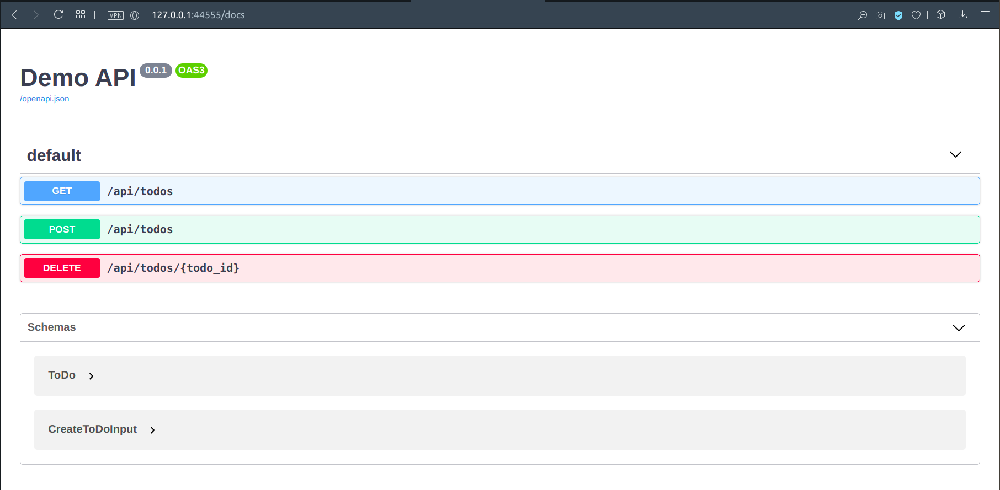
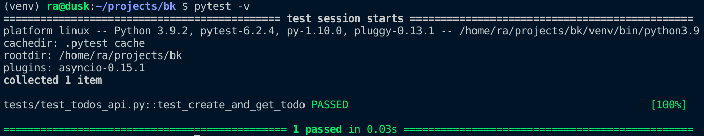

# Testing a BlackSheep app

This page describes how a BlackSheep web application can be tested, documenting
the built-in `TestClient` class and providing a tutorial that shows how it can
be used with `pytest` to test an API. It covers the following:

- [X] How to use the provided `TestClient`.
- [X] How to configure tests using `pytest`.
- [X] How to run integration tests using a server process.

**TL;DR** A complete example with testing configured for `pytest` is
available at:
[./testing-api](https://github.com/Neoteroi/BlackSheep-Examples/tree/main/testing-api).
Those who don't want to follow the tutorial on this page can read the code
in the example.

## Overview of the TestClient class

The `TestClient` class provides useful methods to test a `blacksheep`
application, simulating web requests from an `ASGI` server. Simulating web
requests has the benefit that tests execute fast and don't require a real HTTP
Server and actual HTTP client-server interactions. At the same time, they
recreate a full end-to-end scenario of how requests are handled by an
application server.

A basic example of the `TestClient` would look like this:

```python
import asyncio
from blacksheep import Application
from blacksheep.testing import TestClient

app = Application()


@app.route("/")
async def hello(name: str = "World"):
    return f"Hello, {name}!"


async def test():
    # the application needs to handle its start event, to recreate a valid scenario
    await app.start()

    client = TestClient(app)

    response = await client.get("/")
    text = await response.text()

    assert response.status == 200
    assert text == "Hello, World!"

    response = await client.get("/", query={"name": "Foo"})
    text = await response.text()

    assert response.status == 200
    assert text == "Hello, Foo!"

    print("OK")


asyncio.run(test())

```

A test client provides the following methods:

| Method      | Description                        |
| ----------- | ---------------------------------- |
| **get**     | Simulates an HTTP GET request.     |
| **post**    | Simulates an HTTP POST request.    |
| **put**     | Simulates an HTTP PUT request.     |
| **patch**   | Simulates an HTTP PATCH request.   |
| **delete**  | Simulates an HTTP DELETE request.  |
| **head**    | Simulates an HTTP HEAD request.    |
| **options** | Simulates an HTTP OPTIONS request. |
| **trace**   | Simulates an HTTP TRACE request.   |

!!! info
    By default a `TestClient` simulates web requests creating `ASGI` scopes,
    however it can be configured with a custom implementation of
    `AbstractTestSimulator` to generate real HTTP requests against a real HTTP
    server. For simplicity, this is not documented here.

## Tutorial

This tutorial illustrates how to create a basic TODOs API and prepare tests for
it, step by step.

### Requirements

* The requirements described for the [getting
started tutorial](../getting-started/)
* Familiarity with test frameworks and common concepts like `fixtures`; if you
  are not familiar with this subject, read `pytest` documentation for an
  overview (e.g. [pytest home](https://docs.pytest.org/), [what are
  fixtures](https://docs.pytest.org/en/6.2.x/fixture.html#what-fixtures-are))
* Basic knowledge about [`pydantic`](https://pydantic-docs.helpmanual.io)
  models is a plus, however, the same principles can be applied to Python
  built-in `dataclasses`

### Preparing the project structure
Prepare a Python virtual environment, as described in the [getting started
tutorial](../getting-started). In addition to `blacksheep` and `uvicorn`,
install the following packages in the virtual environment:

```bash
pip install pytest pytest-asyncio pydantic
```

Then create a basic folder structure, like described by the following tree:

```
.
├── app
│   ├── __init__.py
│   ├── app.py
│   └── routes
│       └── __init__.py
├── domain.py
└── server.py
```

For example, using [GNU Bash](https://www.gnu.org/software/bash/):

```bash
mkdir app
touch app/app.py
touch app/__init__.py

mkdir app/routes
touch app/routes/__init__.py

touch domain.py
touch server.py
```

Edit `domain.py` file, to define two domain classes:

```python
from pydantic import BaseModel


class ToDo(BaseModel):
    id: int
    title: str
    description: str


class CreateToDoInput(BaseModel):
    title: str
    description: str
```

To define the API, create a `router.py` file in the `app.routes` package and
copy the following contents into it:

```python
# ./app/routes/router.py

from blacksheep.server.routing import Router


router = Router()

get = router.get
post = router.post
delete = router.delete
```

!!! info
    💡 Declaring the router in a dedicated file is useful to reduce code verbosity
    when defining request handlers.

Then create a `todos.py` file in `app.routes` package, that will contain the
definition of the TODOs API. Start with the following contents:

```python
# ./app/routes/todos.py

from .router import get, post, delete
from domain import ToDo, CreateToDoInput
from typing import List, Optional


@get("/api/todos")
async def get_todos() -> List[ToDo]:
    ...


@get("/api/todos/{todo_id}")
async def get_todo(todo_id) -> Optional[ToDo]:
    ...


@post("/api/todos")
async def create_todo(data: CreateToDoInput) -> ToDo:
    ...


@delete("/api/todos/{todo_id}")
async def delete_todo(todo_id) -> None:
    ...

```

Edit the `__init__.py` file in `app.routes` package, to load
the API definition:

```python
# ./app/routes/__init__.py

from .router import *
from .todos import *
```

Create a `main.py` file in `app` package, that declares an application:

```python
# ./app/main.py
from blacksheep import Application

from .routes import router


app = Application(router=router)
```

And finally a `server.py` file at the project's root:

```python
# ./server.py

from app.main import app
```

### Navigating the API using OpenAPI Documentation

At this point the application can already be started. The API methods are not
implemented, yet, so they cannot do anything interesting. However, the
framework can generate OpenAPI Documentation and expose a documentation UI.

To do so, create a `docs.py` file in the `app` package:

```python
# ./app/docs.py

from blacksheep.server.openapi.v3 import OpenAPIHandler
from openapidocs.v3 import Info

docs = OpenAPIHandler(
    info=Info(title="Demo API", version="0.0.1"), anonymous_access=True
)

# include only endpoints whose path starts with "/api/"
docs.include = lambda path, _: path.startswith("/api/")
```

And modify `/app/main.py` file to configure the generation of OpenAPI
Documentation:

```python
from blacksheep import Application

from .routes import router
from .docs import docs  # +++


app = Application(router=router)
docs.bind_app(app)  # +++
```

Start the application using the following command:

```bash
uvicorn server:app --reload --port=44555
```

And navigate to the [http://127.0.0.1:44555/docs](http://127.0.0.1:44555/docs)
to see the documentation generated automatically by BlackSheep:



Note how, thanks to type annotations and support for `pydantic`, blacksheep
generates automatically OpenAPI Documentation version 3 for all responses
and input request bodies and parameters.

### Creating a mocked TODOs API
For the sake of the testing demo, let's mock the implementation of the TODOs
API to work with data stored in memory:

```python
# ./app/routes/todos.py

from typing import Dict, List, Optional

from blacksheep import not_found
from domain import CreateToDoInput, ToDo

from .router import delete, get, post


_MOCKED: Dict[int, ToDo] = {
    1: ToDo(
        id=1,
        title="BlackSheep Documentation",
        description="Update the documentation with information about the new features.",
    ),
    2: ToDo(
        id=2,
        title="Transfer the documentation",
        description="Transfer the documentation from Azure DevOps to GitHub.",
    ),
    3: ToDo(
        id=3,
        title="Mow the grass",
        description="Like in title.",
    ),
}


@get("/api/todos")
async def get_todos() -> List[ToDo]:
    return list(_MOCKED.values())


@get("/api/todos/{todo_id}")
async def get_todo(todo_id: int) -> Optional[ToDo]:
    try:
        return _MOCKED[todo_id]
    except KeyError:
        return not_found()


@post("/api/todos")
async def create_todo(data: CreateToDoInput) -> ToDo:
    item = ToDo(id=len(_MOCKED) + 1, title=data.title, description=data.description)
    _MOCKED[item.id] = item
    return item


@delete("/api/todos/{todo_id}")
async def delete_todo(todo_id: int) -> None:
    try:
        del _MOCKED[todo_id]
    except KeyError:
        pass

```

Now that the API is mocked, let's see how to add tests for it.

### Using the TestClient with pytest

Create a `tests` package and the following files:

```
└── tests
    ├── __init__.py
    ├── conftest.py
    └── test_todos_api.py
```

`conftest.py` is a special file used by `pytest` to arrange fixtures. Edit this
file to include fixtures definition to arrange tests for the web application:

```python
# ./tests/conftest.py

import asyncio

import pytest
import pytest_asyncio
from blacksheep.testing import TestClient
from server import app as app_server


@pytest.fixture(scope="session")
def event_loop(request):
    loop = asyncio.get_event_loop_policy().new_event_loop()
    yield loop
    loop.close()


@pytest_asyncio.fixture(scope="session")
async def api():
    await app_server.start()
    yield app_server
    await app_server.stop()


@pytest_asyncio.fixture(scope="session")
async def test_client(api):
    return TestClient(api)

```

Note how the file contains three fixtures:

1. `event_loop`, for asyncio: it needs to be redefined to support `session`
   scope
2. `api`, which yields an instance of the started web application
3. `test_client`, which returns the instance of `TestClient` that can be used
   to fire web requests on the web application

These fixtures enable testing all request handlers defined in the application.

!!! info
    💡 It is possible to apply special configuration to the application server,
    for example overriding services in the DI container just for tests, for
    example replacing a class that interacts with a PostgreSQL Server to use
    instead SQLite for tests.

Finally, define a first test for the TODOs API:

```python
# ./tests/test_todos_api.py

from typing import Any

import pytest
from blacksheep.contents import Content
from blacksheep.testing import TestClient
from domain import CreateToDoInput, ToDo
from essentials.json import dumps


def json_content(data: Any) -> Content:
    return Content(
        b"application/json",
        dumps(data, separators=(",", ":")).encode("utf8"),
    )


@pytest.mark.asyncio
async def test_create_and_get_todo(test_client: TestClient) -> None:

    create_input = CreateToDoInput(
        title="Update documentation",
        description="Update blacksheep's documentation to describe all new features.",
    )

    response = await test_client.post(
        "/api/todos",
        content=json_content(create_input),
    )

    assert response is not None

    data = await response.json()

    assert data is not None
    assert "id" in data

    todo_id = data["id"]
    response = await test_client.get(f"/api/todos/{todo_id}")

    assert response is not None
    data = await response.json()

    assert data is not None

    todo = ToDo(**data)

    assert todo.title == create_input.title
    assert todo.description == create_input.description
```

Now it's possible to start the tests using `pytest`:

```bash
pytest
```

If the steps above were done correctly, the test succeeds and `pytest` produces
a feedback like in the following picture (using the verbose flag `-v`):



---

## How to run integration tests using a server process.

The following example shows how to configure a `@pytest.fixture` that starts
an `uvicorn` process in memory to run integration tests against a real `ASGI`
server:

```python
# example server fixture

import os
from multiprocessing import Process
from time import sleep

import pytest
import uvicorn
from server import app


def get_sleep_time():
    # when starting a server process,
    # a longer sleep time is necessary on Windows
    if os.name == "nt":
        return 1.5
    return 0.5


server_host = "127.0.0.1"
server_port = 44555


def _start_server():
    uvicorn.run(app, host=server_host, port=server_port, log_level="debug")


@pytest.fixture(scope="session", autouse=True)
def server():
    server_process = Process(target=_start_server)
    server_process.start()
    sleep(get_sleep_time())

    if not server_process.is_alive():
        raise TypeError("The server process did not start!")

    yield 1

    sleep(1.2)
    server_process.terminate()

```

The same server `host` and `port` can then be used with the desired HTTP Client
implementation to run tests on the server, to recreate a full HTTP
client-server communication.

The following code shows an example of `@pytest.fixture` returning an HTTP
client that can make requests to the running servers, using
**[requests](https://pypi.org/project/requests/)** library:

```python
import requests
from urllib.parse import urljoin


server_host = "127.0.0.1"
server_port = 44555


class ClientSession(requests.Session):
    def __init__(self, base_url):
        self.base_url = base_url
        super().__init__()

    def request(self, method, url, *args, **kwargs):
        return super().request(method, urljoin(self.base_url, url), *args, **kwargs)


@pytest.fixture(scope="session")
def session_two(server_host, server_port_two):
    return ClientSession(f"http://{server_host}:{server_port_two}")
```

And a full example for the TODO API described in the tutorial could look like
the following (the example requires `requests` library):

```python
import os
from multiprocessing import Process
from time import sleep
from urllib.parse import urljoin

import pytest
import requests
import uvicorn
from server import app


class ClientSession(requests.Session):
    def __init__(self, base_url):
        self.base_url = base_url
        super().__init__()

    def request(self, method, url, *args, **kwargs):
        return super().request(method, urljoin(self.base_url, url), *args, **kwargs)


def get_sleep_time():
    # when starting a server process,
    # a longer sleep time is necessary on Windows
    if os.name == "nt":
        return 1.5
    return 0.5


server_host = "127.0.0.1"
server_port = 44555


@pytest.fixture(scope="session")
def client_session():
    return ClientSession(f"http://{server_host}:{server_port}")


def _start_server():
    uvicorn.run(app, host=server_host, port=server_port, log_level="debug")


@pytest.fixture(scope="session", autouse=True)
def server():
    server_process = Process(target=_start_server)
    server_process.start()
    sleep(get_sleep_time())

    if not server_process.is_alive():
        raise TypeError("The server process did not start!")

    yield 1

    sleep(1.2)
    server_process.terminate()


@pytest.mark.asyncio
async def test_get(client_session):
    response = client_session.get("/api/todos/1")

    assert response.status_code == 200

```

!!! info
    Fixtures can be defined in a dedicated module, to keep the tests code
    clean.
